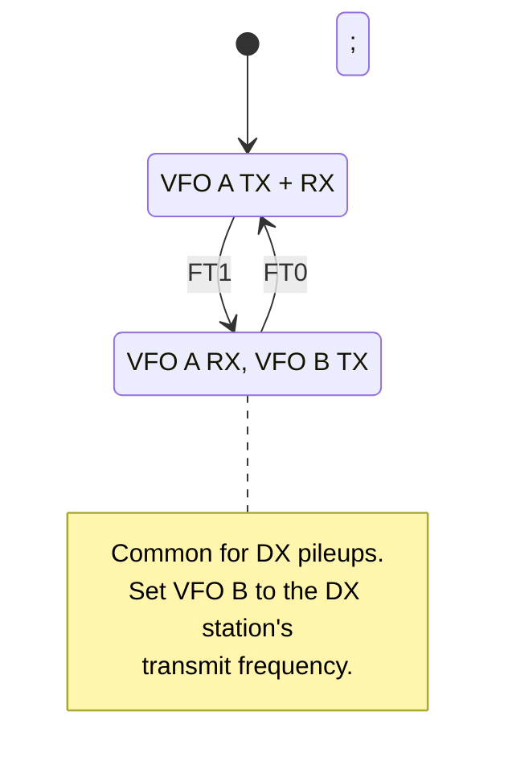

This page covers the advanced operating features of the K3/K3S that go beyond basic frequency, receiver, and transmitter control. These commands handle split operation, the optional sub receiver, diversity reception, memory channels, and several other features commonly used in contest and DX operations. For the complete alphabetical command listing, see the [K3/K3S/KX3/KX2 CAT Command Reference](/elecraft-docs/reference/k3-commands/).

## Commands Used

| Command | Description           | GET | SET |
| ------- | --------------------- | --- | --- |
| `FT`    | TX VFO select (split) | Yes | Yes |
| `FR`    | RX VFO select         | Yes | Yes |
| `SB`    | Sub receiver on/off   | Yes | Yes |
| `DV`    | Diversity mode        | Yes | Yes |
| `MC`    | Memory channel        | Yes | Yes |
| `AN`    | Antenna select        | Yes | Yes |
| `AR`    | RX antenna            | Yes | Yes |
| `RT`    | RIT on/off            | Yes | Yes |
| `XT`    | XIT on/off            | Yes | Yes |
| `RU`    | RIT/XIT up            | No  | Yes |
| `RD`    | RIT/XIT down          | No  | Yes |
| `RC`    | RIT/XIT clear         | No  | Yes |
| `RO`    | RIT/XIT offset        | Yes | Yes |
| `ES`    | ESSB mode             | Yes | Yes |
| `IF`    | General info query    | Yes | No  |

## 1. Split Operation

Split operation means transmitting on a different frequency than you receive on. This is standard practice for working DX pileups, where the DX station listens on a frequency offset from their transmit frequency.

The `FT` command selects which VFO is used for transmit, and the `FR` command selects which VFO is used for receive.

- `FT0;` -- transmit on VFO A (normal, simplex operation)
- `FT1;` -- transmit on VFO B (split mode)
- `FR0;` -- receive on VFO A (normal)
- `FR1;` -- receive on VFO B

To set up a typical DX pileup split, set your receive frequency on VFO A, the DX station's frequency on VFO B, and enable split:

```text
FA00014195000;    RX frequency: 14.195 MHz
FB00014200000;    TX frequency: 14.200 MHz (the DX station)
FT1;              Transmit on VFO B
```

To cancel split and return to simplex operation:

```text
FT0;              Transmit on VFO A (cancel split)
```



:::tip
When working a DX pileup, you can adjust your transmit frequency by changing VFO B with `FB` commands while continuing to listen on VFO A. This lets you move around within the DX station's listening range without losing your receive position.
:::

## 2. Sub Receiver (K3 with KRX3 Option)

The K3 has an optional second receiver (KRX3) that allows simultaneous monitoring of two frequencies. When the sub receiver is enabled, VFO B controls the sub receiver frequency.

- `SB0;` -- sub receiver off
- `SB1;` -- sub receiver on
- When the sub receiver is on, VFO B controls the sub receiver frequency
- All `$` commands (e.g., `AG$`, `BW$`, `SM$`) target the sub receiver
- `SM$;` reads the sub receiver S-meter

```text
SB1;              Turn sub receiver on
FB00014250000;    Set sub receiver to 14.250 MHz
AG$120;           Set sub receiver AF gain to 120
SM$;              Read sub receiver S-meter
SB0;              Turn sub receiver off
```

:::note
The sub receiver requires the KRX3 option. You can check whether KRX3 is installed by reading the `OM;` response -- position 4 will show `S` if the KRX3 is present.
:::

## 3. Diversity Mode (K3 Only)

Diversity reception uses both receivers on the same frequency with different antennas, allowing the DSP to combine the signals for improved reception. This is particularly useful for reducing fading on HF.

- `DV0;` -- diversity mode off
- `DV1;` -- diversity mode on

```text
DV1;              Enable diversity reception
DV;               Query diversity state → DV1;
DV0;              Disable diversity reception
```

When diversity mode is active:

- Both receivers tune to the same frequency
- VFO B filter and mode settings are locked to match VFO A
- The main and sub antennas feed the two receivers independently
- The DSP combines the two received signals to reduce fading and improve signal quality

:::caution
Diversity mode requires the KRX3 sub receiver option. Sending `DV1;` without the KRX3 installed will have no effect. Use two different antennas (or antenna paths) for the main and sub receiver inputs to get the full benefit of diversity reception.
:::

## 4. Memory Channels

The K3/K3S provides 100 memory channels (000-099) that store frequency, mode, filter settings, and other parameters.

- `MC;` -- query current memory channel
- `MC000;` to `MC099;` -- recall a specific memory channel

```text
MC;               Query current memory → MC042;
MC007;            Recall memory channel 7
MC000;            Recall memory channel 0
```

:::note
Memory channels store the complete operating state: frequency, mode, filter bandwidth, and other settings. Recalling a memory channel changes all of these parameters at once. Writing to memory channels is done from the front panel.
:::

## 5. Antenna Selection

The K3/K3S supports two antenna outputs and an optional RX-only antenna input.

### TX/RX Antenna (`AN`)

```text
AN;               Query antenna → AN1;
AN1;              Select ANT 1
AN2;              Select ANT 2
```

### RX Antenna (`AR`)

The `AR` command enables or disables the separate RX-only antenna input on the rear panel. When enabled, the radio receives through the RX ANT jack instead of the main antenna.

```text
AR;               Query RX antenna state → AR0; (off)
AR1;              Enable RX-only antenna
AR0;              Disable RX-only antenna (receive on main antenna)
```

:::tip
The RX antenna input is useful for connecting a dedicated receive antenna (such as a Beverage or loop) that is optimized for low-noise reception. The radio automatically switches back to the main antenna for transmit.
:::

## 6. RIT/XIT Offset

RIT (Receiver Incremental Tuning) offsets the receive frequency without changing the transmit frequency. XIT (Transmitter Incremental Tuning) offsets the transmit frequency without changing the receive frequency. Both are useful for fine-tuning one side of a QSO without disturbing the other.

### RIT/XIT On/Off

```text
RT;               Query RIT state → RT0; (off)
RT1;              Turn RIT on
RT0;              Turn RIT off

XT;               Query XIT state → XT0; (off)
XT1;              Turn XIT on
XT0;              Turn XIT off
```

### Adjusting the Offset

```text
RU;               Increment RIT/XIT offset up
RD;               Increment RIT/XIT offset down
RC;               Clear RIT/XIT offset to zero
```

### Reading/Setting the Absolute Offset (`RO`)

The `RO` command reads or sets the RIT/XIT offset directly as a signed value in Hz.

```text
RO;               Query offset → RO+00100; (+100 Hz)
RO+00100;         Set offset to +100 Hz
RO-00200;         Set offset to -200 Hz
RO 00000;         Set offset to zero
```

:::note
RIT and XIT share the same offset value. Enabling both simultaneously applies the offset to both receive and transmit, which effectively cancels out the offset (since both sides are shifted by the same amount). In practice, you enable one or the other, not both.
:::

## 7. Scanning

The K3 supports frequency scanning, controllable via menu and switch emulation commands. Scanning is not commonly used in programming applications but is available.

```text
SWT09;            Start/stop scan (emulates the scan button)
```

The radio scans through frequencies or memory channels depending on the current scan configuration set via the front-panel menu.

## 8. ESSB (Extended Single Sideband)

ESSB mode extends the SSB transmit bandwidth from the standard ~2.8 kHz to approximately 4-5 kHz, enabling high-fidelity SSB audio.

```text
ES;               Query ESSB state → ES0; (off)
ES1;              Enable ESSB mode
ES0;              Disable ESSB mode
```

:::note
ESSB requires a wider IF filter and appropriate microphone/audio source to be effective. The wider transmit bandwidth uses more spectrum, so ESSB should only be used on relatively clear frequencies where the extra bandwidth will not cause interference to adjacent stations.
:::

## 9. IF General Information Command

The `IF` command returns a comprehensive snapshot of the radio state in a single response. This is the most information-dense command available and is the response that gets sent automatically in `AI1` mode on every front-panel change.

```text
IF;  →  IF00014200000     0000000002000000 ;
        |              |   ||||||||||||||
        +- Frequency   |   |||||||||||||+- Reserved
                       |   ||||||||||||+-- VFO B in use
                       |   |||||||||||+--- Scan status
                       |   ||||||||||+---- Split
                       |   |||||||||+----- CTCSS
                       |   ||||||||+------ Reserved
                       |   |||||||+------- Mode (2=USB)
                       |   ||||||+-------- Data sub-mode
                       |   |||||+--------- RIT on/off
                       |   ||||+---------- XIT on/off
                       |   |||+----------- Memory channel
                       |   ||+------------ TX state
                       |   |+------------- Reserved
                       |   +-------------- RIT/XIT offset
                       +--- Padding/reserved
```

The `IF` response packs the following information into a single string:

- Current VFO frequency (11 digits)
- RIT/XIT offset
- TX state (transmitting or receiving)
- Memory channel number
- RIT and XIT on/off status
- Data sub-mode
- Operating mode (LSB, USB, CW, etc.)
- Split status
- Scan status
- Which VFO is active

:::tip
Parsing the `IF` response is a good way to synchronize your application state with the radio on startup. Send `IF;` once to get a complete snapshot, then use `AI2` mode for incremental updates. This avoids having to send individual GET commands for every parameter.
:::

## Practical Example: DX Pileup Setup

The following sequence configures the radio for working a DX station heard on 14.200 MHz that is listening up 5 kHz:

```text
K31;              Enable extended command mode
FA00014195000;    Set VFO A to 14.195 MHz (your listening frequency)
FB00014200000;    Set VFO B to 14.200 MHz (DX station's frequency)
MD2;              USB mode
FT1;              Enable split (transmit on VFO B)
PC100;            Set power to 100 watts
```

After the QSO, clean up:

```text
FT0;              Cancel split
```

## Next Steps

Continue to [Event Handling](/elecraft-docs/programming/events/) to learn about processing auto-information responses and keeping your application synchronized with the radio state.
