This page covers the full lifecycle of a K3/K3S serial connection: finding the radio on a serial port, identifying the hardware and firmware, managing the power state, and establishing a reliable session.

For general background on command format and serial port settings, see the [Programming Guide overview](/elecraft-docs/programming/).

## Finding the Radio

### Serial Port Discovery

The K3/K3S appears as a standard serial port. The port name depends on the operating system:

- **Windows** — COM ports (`COM1`, `COM3`, etc.). Enumerate with the Win32 `SetupDi` API or by scanning `COM1` through `COM32`.
- **macOS** — `/dev/tty.usbserial-*` or `/dev/cu.usbserial-*` (FTDI-based KIO3 USB).
- **Linux** — `/dev/ttyUSB0`, `/dev/ttyACM0`, or similar.

To locate the K3 programmatically, iterate through available serial ports and probe each one.

### Probing a Port

Send a single semicolon (`;`) as a no-op probe. The K3 ignores unknown or empty commands without producing an error, so this is a safe way to test whether a K3 is listening:

```text
;           → (no response, but port is valid if no error occurs)
```

A more definitive approach is to send the identification command:

```text
ID;         → ID017;
```

The `ID017;` response confirms a K3 or K3S is connected.

:::note
If no response arrives within 500 ms, the port likely does not have a K3 attached. Move on to the next candidate port.
:::

## Identification Commands

Once you have found the radio, three commands give you everything you need to know about the hardware.

### Radio Model (`ID`)

```text
ID;         → ID017;
```

The value `017` identifies the K3 family. The K3, K3S, KX3, and KX2 all return `ID017;`. If you need to distinguish between them, use the `OM` command or firmware revision string.

### Installed Options (`OM`)

```text
OM;         → OM AP----T-;
```

The response contains a nine-character option map following the `OM` prefix. Each position corresponds to a specific option module. A letter means the option is installed; a dash (`-`) means it is not.

| Position | Letter | Option Module                      |
| -------- | ------ | ---------------------------------- |
| 1        | `A`    | KAT3 / KAT3A internal autotuner    |
| 2        | `P`    | KPA3 / KPA3A 100 W amplifier       |
| 3        | `R`    | K160RX 160 m receive option        |
| 4        | `S`    | KRX3 sub receiver                  |
| 5        | `D`    | KDVR3 digital voice recorder       |
| 6        | `N`    | KNB3 noise blanker                 |
| 7        | `-`    | Reserved                           |
| 8        | `T`    | KXV3 / KXV3A transverter interface |
| 9        | `-`    | Reserved                           |

In the example response `OM AP----T-;`, the KAT3, KPA3, and KXV3 are installed.

:::note
The installed options determine which commands are available. For example, sub-receiver commands only function when the KRX3 is present (position 4 shows `S`).
:::

### Firmware Revision (`RV`)

```text
RV;         → RV02.78;
```

The firmware version is returned as a dotted decimal string. Some commands require a minimum firmware version, so recording this value during initialization is important.

## Power State

The K3 has two power states controlled by the `PS` command. The rear-panel power switch must be on (providing standby power) for serial commands to work at all.

```mermaid
stateDiagram-v2
    [*] --> Off
    Off --> PoweringOn: PS1; (power on)
    PoweringOn --> Ready: Wait 4-5 seconds
    Ready --> Off: PS0; (power off)
    Ready --> Ready: Normal operation

    note right of PoweringOn
        K3 needs 4-5 seconds to boot.
        Do not send commands during boot.
    end note
```



### Querying Power State

```text
PS;         → PS0;    (radio is off / standby)
PS;         → PS1;    (radio is on)
```

### Powering On

```text
PS1;        → (radio begins booting)
```

After sending `PS1;`, wait at least 4 seconds before sending any other commands. The K3 performs internal calibration during boot and will not respond reliably until it is complete.

### Powering Off

```text
PS0;        → (radio enters standby)
```

:::caution
If the rear-panel power switch is off, the radio has no standby power and will not respond to any serial commands, including `PS1;`. The rear switch must be on for remote power control to work.
:::

## Initialization Sequence

The recommended startup handshake discovers the hardware, enables extended command mode, and turns on event-driven updates.

```mermaid
sequenceDiagram
    participant PC as Computer
    participant K3 as K3/K3S

    PC->>K3: ; (probe)
    Note over PC: Wait 500ms for any response
    PC->>K3: ID;
    K3->>PC: ID017;
    Note over PC: Confirmed K3/K3S

    PC->>K3: OM;
    K3->>PC: OM AP----T-;
    Note over PC: Record installed options

    PC->>K3: RV;
    K3->>PC: RV02.78;
    Note over PC: Record firmware version

    PC->>K3: K31;
    Note over K3: Enable extended command mode

    PC->>K3: AI2;
    Note over K3: Enable auto-info mode 2

    Note over PC,K3: Connection established
```

### Step-by-Step

1. **Probe** — Send `;` or `ID;` to verify the radio is present on the port. If `ID;` returns `ID017;`, you have a K3-family radio.

2. **Discover options** — Send `OM;` and parse the option map. Store the result so your application knows which features are available (sub receiver, autotuner, voice recorder, etc.).

3. **Check firmware** — Send `RV;` and record the version. Certain commands or behaviors vary by firmware revision.

4. **Enable extended mode** — Send `K31;` to enter K3 extended command mode. This unlocks additional commands and response formats that are not available in the default K2-compatible mode.

5. **Enable auto-info** — Send `AI2;` to activate auto-information mode 2. In this mode the K3 spontaneously sends status updates whenever the operator changes a setting on the front panel, eliminating the need to poll.

:::note
If you only need basic Kenwood-compatible CAT commands and do not want extended K3 features, you can skip the `K31;` step. However, most K3-specific applications benefit from extended mode.
:::

## Disconnection

When your application is finished with the radio, clean up the session before closing the serial port:

1. **Disable auto-info** — Send `AI0;` to stop unsolicited status messages. Leaving auto-info enabled after disconnecting can cause data to accumulate in the serial buffer.

2. **Power off (optional)** — Send `PS0;` if you want to put the radio into standby.

3. **Close the port** — Release the serial port so other applications can use it.

```text
AI0;        → (auto-info disabled)
PS0;        → (radio enters standby, optional)
```

## Multiple Application Considerations

:::caution
Only one application should hold the serial port open at a time. Sending interleaved commands from multiple programs will corrupt both the command stream and the response parsing.
:::

- **Virtual serial port splitters** — Some operators use software such as LP-Bridge, VSPE, or com0com to share a single COM port among multiple programs (logger, rig control, digital modes). While this can work, be aware that command conflicts are possible if two programs send commands simultaneously or if both enable `AI` mode.

- **KIO3 USB interface** — The K3's KIO3 board provides a single USB serial connection. This is the same port used for firmware updates. There is no second independent serial channel on the radio itself.

- **RS-232 vs. USB** — The K3 supports both an RS-232 port (directly on the KIO3 rear connector) and USB. Only one can be active at a time; they share the same internal UART.

## Next Steps

Continue to [Frequency & Modes](/elecraft-docs/programming/frequency-modes/) to learn how to read and set VFO frequencies, operating modes, and filter bandwidths.
