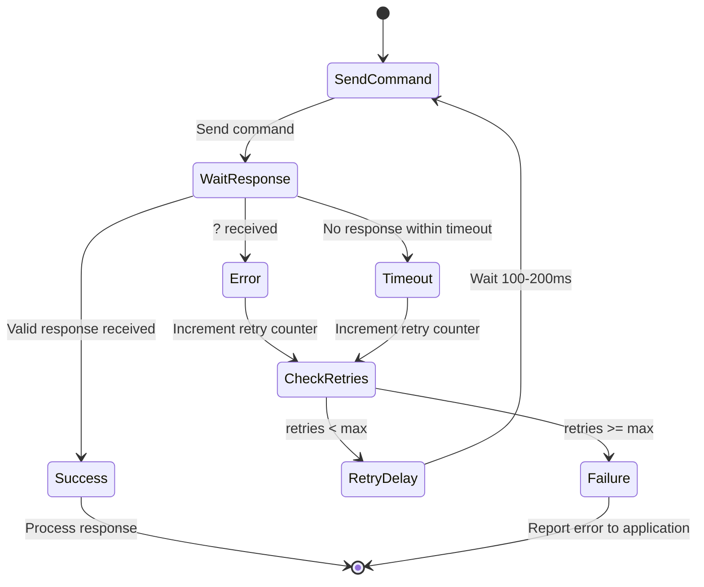

Robust error handling is essential for any application controlling a K3/K3S over serial. The radio's error reporting is minimal — a single `?;` response for all failures — so your application must be prepared to detect problems, retry intelligently, and recover gracefully.

## Error Response Format

The K3 has a single error indicator: `?;` — sent in response to any command that cannot be processed.

Causes of `?;`:

- Unknown command prefix
- Invalid parameter value or format
- Command not applicable in current mode
- Radio is busy (e.g., during band change, menu operation)
- Command buffer overflow

:::caution
The `?;` response does not tell you WHY the command failed. You must infer the cause from context.
:::

## Error Recovery State Machine

The following state diagram shows a general-purpose retry loop for sending commands to the K3:



## Timeout Handling

- Typical response time: 10-50ms for most commands
- Recommended timeout: 500ms for normal commands
- Longer timeout (2-3 seconds) for:
  - `PS1;` (power on — radio needs 4-5 seconds to boot)
  - `BN` (band change — involves relay switching)
  - `SWT`/`SWH` (switch emulation — may trigger multi-step operations)

```text
Recommended timeout values:
  Normal commands:     500ms
  Band change (BN):    1000ms
  Power on (PS1):      5000ms
  Switch emulation:    1000ms
  Tune operation:      3000ms
```

:::note
The `PS1;` power-on command is a special case. The radio takes 4-5 seconds to boot, during which it will not respond to any commands. Wait for the full boot sequence to complete before sending further commands.
:::

## Retry Strategy

```text
function send_command(cmd, max_retries=3):
    for attempt in 1..max_retries:
        serial.write(cmd)
        response = serial.read(timeout=500ms)

        if response is valid:
            return response

        if response == "?;":
            wait(100ms * attempt)  // Back off
            continue

        if response is timeout:
            wait(200ms)
            continue

    raise CommandError("Failed after max retries")
```

:::tip
Use exponential or linear back-off between retries. The radio may be temporarily busy processing a previous command or switching bands.
:::

## Serial Buffer Management

The K3 has a limited serial input buffer (~80 characters). Problems occur when:

- Sending commands too fast (buffer overflow)
- Not reading responses (output buffer backs up)
- Sending during band changes or boot

Best practices:

- **Wait for response** before sending the next command (command-response pattern)
- If using fire-and-forget SETs, add a small delay (20-50ms) between commands
- After a band change (`BN`), wait 300ms before sending more commands
- Flush the serial input buffer after any error sequence

## Common Error Scenarios

### Busy During Band Change

```text
BN05;          → (radio switching bands)
FA;            → ?;    (radio busy switching)
               Wait 300ms...
FA;            → FA00014200000;    (now ready)
```

### Invalid Parameter

```text
MD8;           → ?;    (mode 8 doesn't exist)
PC200;         → ?;    (200W exceeds K3 max of 110W)
FA99999999999; → ?;    (frequency out of range)
```

### Command in Wrong Mode

```text
DT2;           → ?;    (DT only works in DATA mode)
               Fix: MD6; first, then DT2;
```

## Defensive Programming Patterns

### Verify After Set

Always verify critical settings took effect:

```text
FA00014200000;    SET frequency
FA;               GET to verify
                  → FA00014200000; (confirmed)
```

### State Validation Before Action

```text
TQ;               Check TX state before changing frequency
                  → TQ0; (receiving — safe to proceed)
FA00014200000;    Change frequency
```

### Graceful Degradation

```text
OM;               Check installed options
                  → OM AP--------;
                  No KRX3 (position 4 = '-')
                  → Skip sub-receiver commands
```

:::tip
Querying the option module status with `OM;` at startup lets your application adapt to the specific hardware configuration, avoiding errors from commands that require options the radio does not have installed.
:::

## Serial Port Error Handling

Beyond protocol errors, handle serial port issues:

- **Port disconnected**: USB cable unplugged, radio powered off at rear switch
- **Garbled data**: Baud rate mismatch, electrical interference
- **Stuck port**: Another application holding the port

If you receive garbled responses:

1. Flush serial buffers (both input and output)
2. Send `;;` (two semicolons) to re-synchronize — discards any partial command in the K3's buffer
3. Send `ID;` to verify the connection is still valid
4. If `ID;` fails, re-establish the connection from scratch

:::note
The double-semicolon `;;` trick works because the K3 treats each semicolon as a command terminator. If the radio has a partial command sitting in its parser (e.g., from a garbled transmission), the first semicolon terminates that partial command (producing a `?;` error), and the second semicolon is a harmless empty command. This leaves the parser in a clean state.
:::
