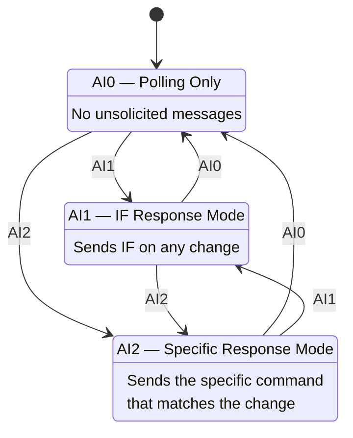
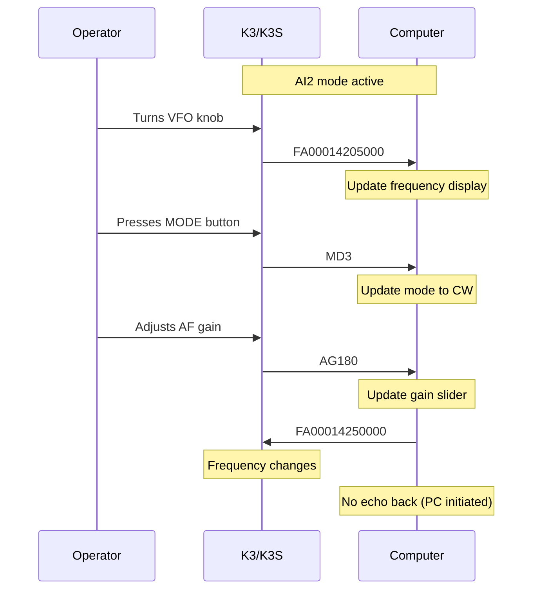

This page covers the K3/K3S auto-information (AI) system, which allows the radio to push status changes to your application in real time. Understanding AI modes is key to building responsive software without resorting to constant polling.

For complete command syntax and all parameter details, see the [K3/K3S/KX3/KX2 CAT Command Reference](/elecraft-docs/reference/k3-commands/).

## 1. The Auto-Information System

The K3 can notify the computer when the operator changes settings on the front panel. This avoids constant polling and lets your application react immediately to operator actions.

### AI Modes

The `AI` command selects one of three notification modes:



- **AI0** (default): Radio sends nothing unsolicited. You must poll for every piece of info.
- **AI1**: On any front-panel change, the radio sends the `IF` response (the all-in-one status string). Simple but less granular — you must parse the IF response to determine what changed.
- **AI2** (recommended): On a front-panel change, the radio sends the specific response for what changed. If the operator changes frequency, you receive `FA00014200000;`. If they change mode, you receive `MD2;`. Much easier to handle programmatically.

:::tip
Use `AI2;` for most applications. It provides specific, targeted updates without the overhead of parsing the `IF` mega-response on every change.
:::

## 2. Event Flow with AI2

The following diagram shows how AI2 mode delivers targeted events for each front-panel action:



Key behavior:

- Auto-info responses are sent only for changes made via front panel (knobs, buttons).
- Changes made via CAT commands from the computer do **not** trigger auto-info responses.
- This prevents echo loops: PC sends command, K3 changes, K3 does **not** send a response back.

:::note
The no-echo behavior is essential. Without it, a computer-initiated frequency change would trigger an auto-info response, which your software might interpret as a new operator change, potentially creating an infinite loop.
:::

## 3. Polling Strategy (AI0)

When using AI0 mode (polling only), you must explicitly request every piece of information:

- Poll at a reasonable rate: 5--10 times per second is typically sufficient.
- Don't flood the serial port — the K3 has a limited command buffer.
- Common polling pattern: cycle through `FA;`, `MD;`, `SM;`, `TQ;`.

```text
Loop every 200ms:
  FA;    → read frequency
  MD;    → read mode
  SM;    → read S-meter
  TQ;    → read TX state
```

:::caution
Polling too fast (more than ~20 commands per second) can overflow the K3's serial input buffer, causing missed commands or garbled responses. With AI2 mode, you can poll much less frequently since changes are pushed to you.
:::

## 4. Handling Unsolicited Responses

When AI1 or AI2 is active, your serial read loop must handle data arriving at any time:

1. **Buffer incoming data** — responses may arrive mid-command or between your polls.
2. **Parse on semicolons** — split the input buffer on `;` to isolate complete responses.
3. **Identify the command prefix** — the first 2--3 characters indicate which command/parameter changed.
4. **Route to handlers** — dispatch to the appropriate handler based on the command prefix.

Pseudocode pattern:

```text
buffer = ""
while connected:
    buffer += serial.read()
    while ";" in buffer:
        message, buffer = buffer.split(";", 1)
        message += ";"
        prefix = message[0:2]
        handle_response(prefix, message)
```

:::tip
Always process **all** complete messages in the buffer before reading more data. A single `serial.read()` call may return multiple semicolon-delimited responses if several front-panel changes happened in quick succession.
:::

## 5. Common Auto-Info Events

The following table lists the most frequently seen auto-info responses in AI2 mode:

| Event            | AI2 Response              | Meaning                     |
| ---------------- | ------------------------- | --------------------------- |
| VFO A tuned      | `FA...;`                  | Frequency changed           |
| VFO B tuned      | `FB...;`                  | VFO B frequency changed     |
| Mode changed     | `MD.;`                    | Operating mode changed      |
| Band changed     | `BN..;` then `FA...;`     | Band switch + new frequency |
| Filter adjusted  | `BW....;` or `FW.......;` | Bandwidth changed           |
| AF gain adjusted | `AG...;`                  | Volume changed              |
| Preamp toggled   | `PA.;`                    | Preamp on/off               |
| TX/RX change     | `TQ.;`                    | Transmit state changed      |

## 6. Combining Polling and Events

Best practice: use AI2 for real-time updates, but still poll periodically for:

- S-meter readings (`SM;`) — not sent as auto-info
- SWR readings (`SW;`) during transmit
- Power meter readings (`BG;`)

These metering values must always be polled since they change continuously and would flood the serial link if sent automatically.

:::note
A typical hybrid approach sets `AI2;` at connection time, then runs a slow polling loop (2--5 Hz) for metering data only. All other parameter changes arrive as unsolicited responses, so there is no need to poll for frequency, mode, gain, or filter settings.
:::

## 7. The IF Command in Detail

For AI1 mode, all events arrive as the `IF` response. Its fields (38 characters total):

```text
IF[freq 11][5 spaces][rit offset 5][rit on][xit on][tx][mode][vfo][scan][split][tone][tone#][000];
```

While AI2 is simpler for event-driven programming, the `IF;` command remains useful as a single-command snapshot of the radio's complete state. Send `IF;` at connection time to initialize all your display fields at once, then rely on AI2 events for ongoing updates.

For the full field-by-field breakdown of the `IF` response, see the [K3/K3S/KX3/KX2 CAT Command Reference](/elecraft-docs/reference/k3-commands/).
