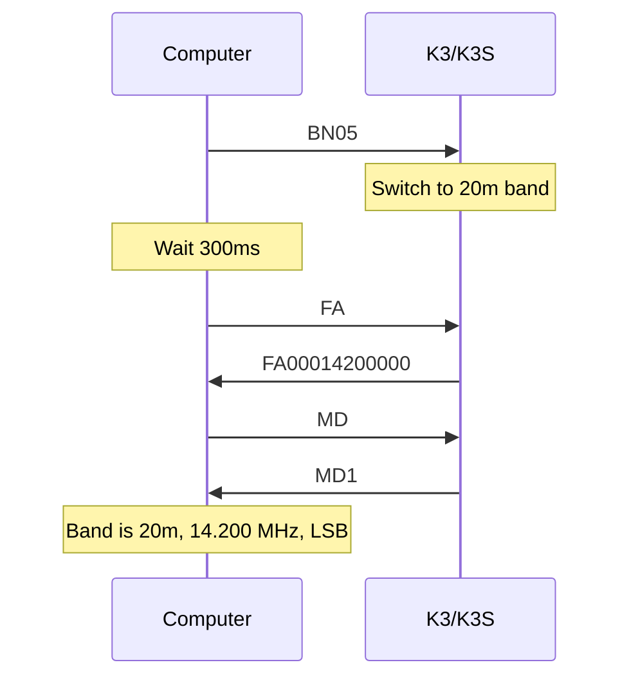
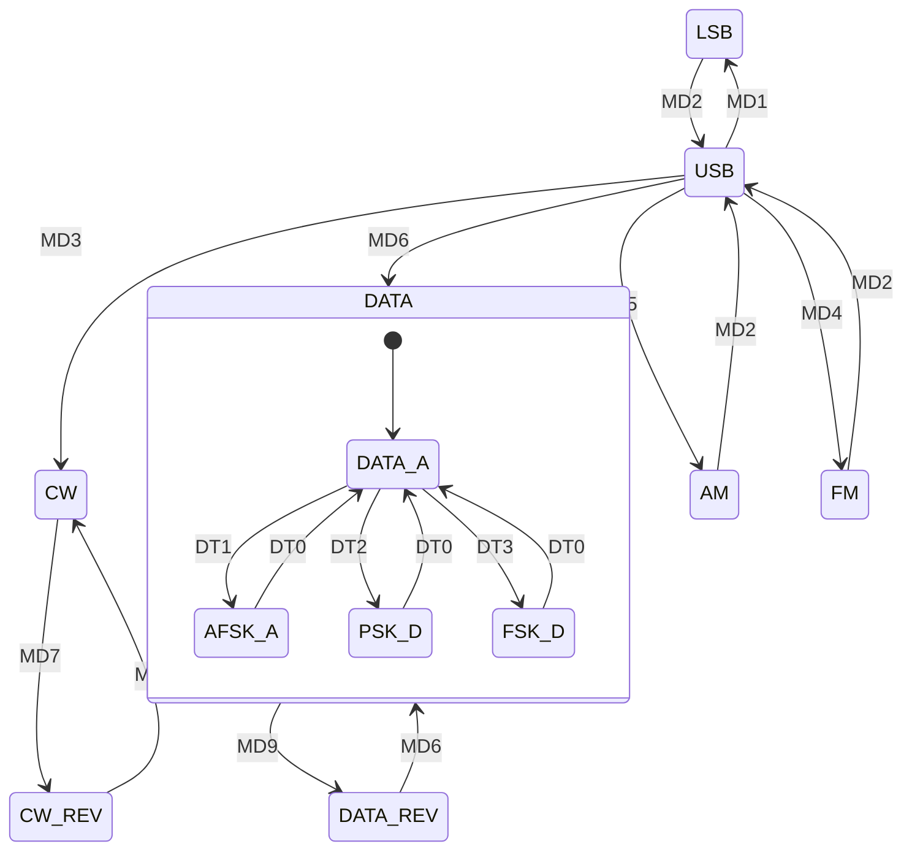

This page covers the commands used to control VFO frequencies, select operating modes, change bands, and configure DATA sub-modes on the K3/K3S. For the complete alphabetical command listing, see the [K3/K3S/KX3/KX2 CAT Command Reference](/elecraft-docs/reference/k3-commands/).

## VFO Frequency Control

The `FA` and `FB` commands read and set the frequency of VFO A and VFO B respectively. Frequencies are expressed as 11-digit values in Hz, zero-padded on the left.

```text
FA00014200000;       Set VFO A to 14.200000 MHz
FB00007050000;       Set VFO B to 7.050000 MHz
```

To read the current frequency, send the command with no parameter:

```text
FA;                  Query VFO A frequency
                     → FA00014200000;
```

The valid frequency range is 0.5 MHz to 54 MHz on the K3/K3S. Exact upper and lower limits depend on the installed band modules and transverter configuration.

### VFO Stepping

The `UP` / `DN` commands step VFO A up or down by the current tuning rate. `UPB` / `DNB` do the same for VFO B.

```text
UP;                  Step VFO A up by the current rate
DN;                  Step VFO A down by the current rate
UPB;                 Step VFO B up
DNB;                 Step VFO B down
```

:::note
The step size depends on the current tuning rate set on the radio. Use the front-panel rate controls or the relevant menu entry to adjust the step increment.
:::

## Band Selection

The `BN` command queries or sets the current band by number.

```text
BN;                  Query current band → BN07; (15m)
BN05;                Switch to 20m band
```

Band numbers map as follows:

| Number | Band | Number | Band          |
| ------ | ---- | ------ | ------------- |
| 00     | 160m | 08     | 12m           |
| 01     | 80m  | 09     | 10m           |
| 02     | 60m  | 10     | 6m            |
| 03     | 40m  | 11     | Transverter 1 |
| 04     | 30m  | 12     | Transverter 2 |
| 05     | 20m  | 13     | Transverter 3 |
| 06     | 17m  | 14     | Transverter 4 |
| 07     | 15m  | 15     | Transverter 5 |

:::caution
After sending a band-change command, the radio needs time to switch relays and restore the last-used frequency and mode for that band. Wait at least 300 ms before querying `FA;` and `MD;` to confirm the new state. Polling too soon may return stale values.
:::

### Band Change Sequence

The recommended pattern for changing bands and confirming the result:



## Operating Modes

The `MD` command reads or sets the operating mode. Each mode is represented by a single digit:

| Value | Mode | Value | Mode     |
| ----- | ---- | ----- | -------- |
| 1     | LSB  | 6     | DATA     |
| 2     | USB  | 7     | CW-REV   |
| 3     | CW   | 9     | DATA-REV |
| 4     | FM   |       |          |
| 5     | AM   |       |          |

```text
MD;                  Query current mode → MD2; (USB)
MD6;                 Switch to DATA mode
MD3;                 Switch to CW mode
```

Use `MD$` to target VFO B / sub receiver mode instead of VFO A / main receiver.

:::note
There is no mode value 8. The mode numbers follow the Kenwood command convention used by many logging and contest programs.
:::

### Mode Transitions

The diagram below shows the available mode transitions and the commands that trigger them:



## DATA Sub-Modes

When the operating mode is DATA (`MD6`) or DATA-REV (`MD9`), the `DT` command selects the DATA sub-mode:

| Value | Sub-Mode | Description                        |
| ----- | -------- | ---------------------------------- |
| 0     | DATA A   | Default, uses MIC/LINE audio input |
| 1     | AFSK A   | Audio FSK                          |
| 2     | FSK D    | Direct FSK keying                  |
| 3     | PSK D    | Direct PSK                         |

```text
DT;                  Query DATA sub-mode → DT0;
DT1;                 Switch to AFSK A sub-mode
```

:::caution
The `DT` command only has effect when the radio is in DATA or DATA-REV mode (`MD6` or `MD9`). Setting `DT` in other modes is accepted but has no operational effect until you switch to a DATA mode.
:::

## Linked VFOs

The `LN` command links or unlinks VFO A and VFO B:

```text
LN1;                 Link VFOs (A and B track together)
LN0;                 Unlink VFOs
LN;                  Query link state → LN0; or LN1;
```

When linked, changing VFO A frequency also changes VFO B to the same frequency. This is useful for simplex operation where both VFOs should remain on the same frequency.

## VFO A/B Operations

Several commands control VFO swapping, copying, and TX/RX assignment:

### Swap and Copy

```text
SWT19;               Emulates A/B button tap — swap VFO A and VFO B
SWT20;               Emulates A=B button tap — copy VFO A to VFO B
```

### TX and RX VFO Selection

The `FT` command selects which VFO is used for transmit. The `FR` command selects which VFO is used for receive.

```text
FT0;                 VFO A transmits
FT1;                 VFO B transmits (split operation)
FR0;                 Receive on VFO A
FR1;                 Receive on VFO B
```

:::note
Setting `FT1;` with VFO A and VFO B on different frequencies enables split operation. This is the standard approach for working DX stations or repeaters with separate TX and RX frequencies.
:::

## Practical Patterns

### Setting Frequency and Mode

A typical sequence to configure the radio for FT8 on 20 meters:

```text
FA00014074000;       Set VFO A to 14.074 MHz (FT8 frequency)
MD6;                 Set DATA mode
DT0;                 Set DATA A sub-mode
```

### Reading Current State

Query all relevant frequency and mode parameters in one burst:

```text
FA;                  Query VFO A → FA00014074000;
MD;                  Query mode → MD6;
DT;                  Query DATA sub-mode → DT0;
BN;                  Query band → BN05;
```

:::tip
When building a status display or synchronizing with logging software, query `FA`, `MD`, `DT`, and `BN` together to get a complete picture of the current operating state. If you have auto-information enabled (`AI2`), these values are pushed to you automatically when they change — see [Event Handling](/elecraft-docs/programming/events/) for details.
:::
