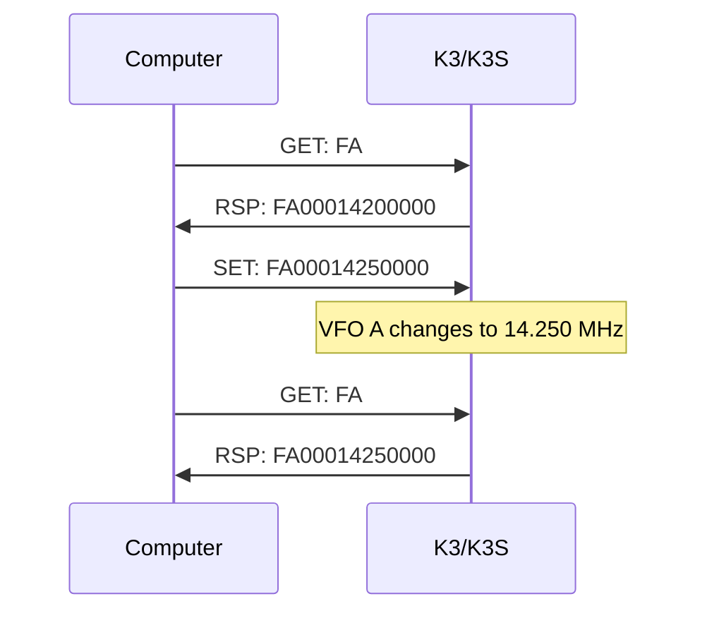

This guide walks through the Elecraft K3/K3S CAT (Computer Aided Transceiver) serial protocol from a programmer's perspective. It is organized by task rather than by command name, so you can find the commands you need for each aspect of radio control without reading the entire protocol specification.

For a complete alphabetical listing of every command, see the [K3/K3S/KX3/KX2 CAT Command Reference](/elecraft-docs/reference/k3-commands/).

## Serial Connection Setup

The K3/K3S accepts commands over a standard serial connection. Two physical interfaces are available:

- **USB** via the KIO3 or KUSB board, which provides a virtual COM port on the host computer
- **RS-232** via the DB-9 connector on the rear panel

Default serial parameters:

| Parameter    | Value |
| ------------ | ----- |
| Baud rate    | 38400 |
| Data bits    | 8     |
| Parity       | None  |
| Stop bits    | 1     |
| Flow control | None  |

:::tip
The `BR` command can query or change the baud rate. The parameter values are: `0`=4800, `1`=9600, `2`=19200, `3`=38400, `4`=57600, `5`=115200. Send `BR;` to read the current rate, or `BR4;` to switch to 57600 baud.
:::

All commands are plain ASCII text terminated with a semicolon (`;`). Responses from the radio also end with `;`. There is no line-feed or carriage-return delimiter — the semicolon is the only framing character.

```text
FA;                  → query VFO A frequency
FA00014200000;       ← radio responds with the current frequency
```

## GET / SET / RSP Model

Every interaction with the K3/K3S follows a simple three-part model:

**SET** — Send a command with data to change a radio parameter.

```text
FA00014200000;       Set VFO A to 14.200 MHz
MD1;                 Set mode to LSB
KS020;               Set keyer speed to 20 WPM
```

**GET** — Send the command letters with no data (just the terminating `;`) to read the current value.

```text
FA;                  Query VFO A frequency
MD;                  Query current mode
KS;                  Query keyer speed
```

**RSP** — The radio responds with the command letters followed by the current data, in the same format as a SET.

```text
FA00014200000;       VFO A is at 14.200 MHz
MD1;                 Mode is LSB
KS020;               Keyer speed is 20 WPM
```



:::note
Characters sent to the K3 can be upper or lower case. The radio always responds in upper case.
:::

### VFO B / Sub Receiver Commands

Many commands accept a `$` suffix to target VFO B or the sub receiver instead of VFO A / main receiver. For example:

```text
AG;                  GET main receiver AF gain
AG$;                 GET sub receiver AF gain
AG120;               SET main receiver AF gain to 120
AG$120;              SET sub receiver AF gain to 120
```

Commands that support the `$` suffix are marked with `$` in the [command reference](/elecraft-docs/reference/k3-commands/).

## Extended Command Mode

Before issuing most commands, enable K3 extended mode with the `K3` command. This unlocks the full command set and extended response formats.

```text
K31;                 Enable extended K3 command mode
K30;                 Return to basic (K2-compatible) mode
```

:::caution
Some commands and response fields are only available in extended mode (`K31`). Always send `K31;` at the start of your session to ensure consistent behavior.
:::

## Auto-Information Modes

By default, the K3 only sends data in response to a GET command. The `AI` command enables automatic notifications when the radio state changes — either from front-panel controls or from other software.

| Mode   | Behavior                                                                      |
| ------ | ----------------------------------------------------------------------------- |
| `AI0;` | Polling only (default). The radio never sends unsolicited data.               |
| `AI1;` | The radio sends an `IF` response whenever any front-panel change occurs.      |
| `AI2;` | The radio sends the specific command response matching the changed parameter. |

:::tip
`AI2` is recommended for most applications. It gives you fine-grained, targeted notifications without the overhead of constantly polling. For example, if the operator turns the VFO knob, you receive `FA` responses with the new frequency rather than a generic `IF` block that must be parsed.
:::

See the [Event Handling](/elecraft-docs/programming/events/) page for details on processing auto-information responses.

## Guide Organization

Each page in this guide focuses on a specific area of radio control. They are meant to be read in order the first time, then used as a reference afterward.

| Page                                                             | Covers                                                                            |
| ---------------------------------------------------------------- | --------------------------------------------------------------------------------- |
| [Connection & Discovery](/elecraft-docs/programming/connection/) | Finding the serial port, verifying the radio identity, and establishing a session |
| [Frequency & Modes](/elecraft-docs/programming/frequency-modes/) | Setting and reading VFO frequencies, operating modes, and band selection          |
| [Receiver Control](/elecraft-docs/programming/receiver/)         | AF/RF gain, filters, bandwidth, AGC, noise blanker, and DSP settings              |
| [Transmitter Control](/elecraft-docs/programming/transmitter/)   | TX/RX switching, power output, SWR metering, and mic gain                         |
| [Voice, CW & Data](/elecraft-docs/programming/voice-cw-data/)    | CW keying, stored messages, data sub-modes, and voice operations                  |
| [Advanced Features](/elecraft-docs/programming/advanced/)        | Split operation, sub receiver, diversity reception, and memory channels           |
| [Event Handling](/elecraft-docs/programming/events/)             | Auto-information modes, unsolicited responses, and state synchronization          |
| [Error Handling](/elecraft-docs/programming/errors/)             | Timeout handling, error recovery, and retry patterns                              |
| [KPA500 Integration](/elecraft-docs/programming/kpa500/)         | Amplifier power, band tracking, fault monitoring, and standby control             |
| [KAT500 Integration](/elecraft-docs/programming/kat500/)         | Antenna tuner control, tune initiation, and antenna selection                     |
| [Station Integration](/elecraft-docs/programming/station/)       | Coordinating K3 + KPA500 + KAT500 as a unified station                            |
