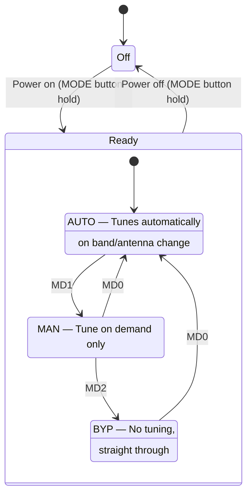
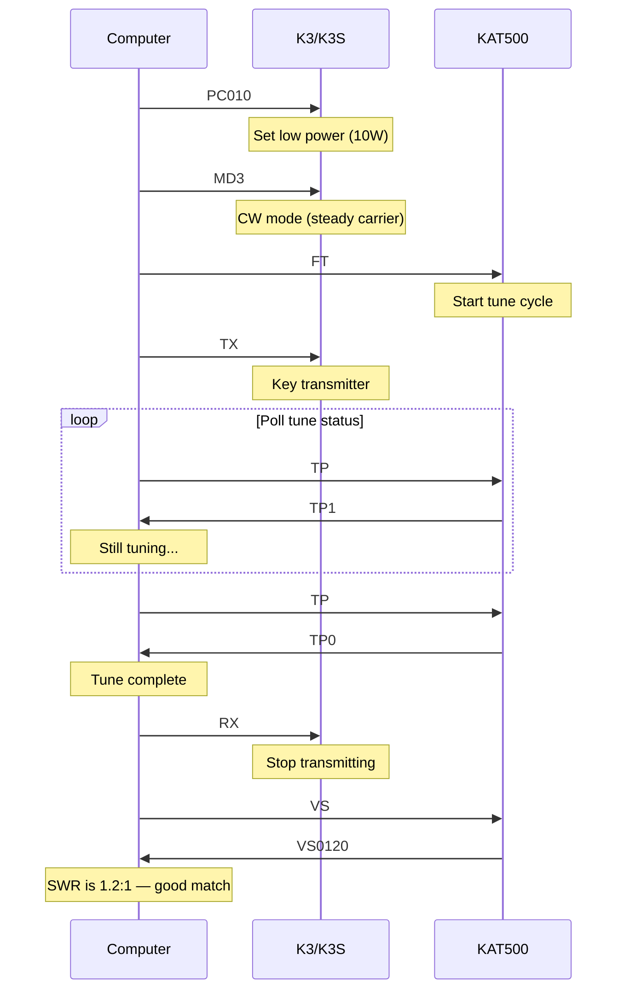

The KAT500 is a high-power automatic antenna tuner designed to pair with the KPA500 amplifier and K3 transceiver. Like the KPA500, it has its own serial port and a separate command protocol, but uses the same semicolon-terminated ASCII format.

For the complete alphabetical command listing, see the [KAT500 Command Reference](/elecraft-docs/reference/kat500-commands/). For product details, see the [KAT500 product page](/elecraft-docs/kat500/).

## 1. KAT500 Overview

The KAT500 handles the antenna matching side of a high-power station. Key features:

- Handles up to 500 watts
- 3 antenna outputs (ANT 1, 2, 3)
- Automatic band following via serial daisy-chain through KPA500
- Stores tuning solutions per band/antenna combination
- Bypass mode for antennas that don't need tuning

## 2. Serial Connection

The KAT500 serial port can be daisy-chained through the KPA500, or connected directly to a PC.

- **Daisy-chain** — K3 AUX serial out → KPA500 → KAT500. Band changes propagate automatically through the chain.
- **Direct connection** — connect the KAT500 RS-232 port directly to a PC serial port or USB-to-serial adapter.
- **Default settings** — 38400 baud, 8 data bits, no parity, 1 stop bit (8N1).
- **Command format** — same semicolon-terminated ASCII commands used by the K3 and KPA500.

:::tip
The daisy-chain approach is the simplest setup. The KPA500 passes band change information through to the KAT500, so you only need one serial connection from the PC to the K3.
:::

## 3. KAT500 Operating Modes

The KAT500 has three operating modes that control when and whether tuning occurs.



| Mode   | Command | Behavior                                           |
| ------ | ------- | -------------------------------------------------- |
| Auto   | `MD0;`  | Tunes automatically on band or antenna changes     |
| Manual | `MD1;`  | Tunes only when you send `FT;` or `MT;`            |
| Bypass | `MD2;`  | RF passes straight through, no L-C network in line |

## 4. Wake-Up

The KAT500 has a power-saving sleep mode. After a period of inactivity, it enters a low-power state where it does not process commands immediately.

To wake the KAT500:

1. Send any command (or `;;` as a wake-up probe).
2. Wait 100 ms for the unit to wake.
3. Send the actual command.

```text
;;             Wake-up probe (two semicolons)
               Wait 100ms
BN;            Now send the real command
```

:::note
The first command after sleep may not be processed. Always send a throwaway command or `;;` and pause before issuing real commands.
:::

## 5. Band Control

The KAT500 uses the same band numbering as the K3.

| Command | Response | Description        |
| ------- | -------- | ------------------ |
| `BN;`   | `BN05;`  | Query current band |
| `BN05;` | —        | Set band to 20m    |

When daisy-chained through the KPA500, the KAT500 follows band changes automatically. When connected independently via its own serial port, you must send `BN` commands to keep it synchronized with the K3.

```text
BN;            Query current band → BN05; (20m)
BN07;          Switch to 15m band
```

:::caution
If the KAT500 is connected directly to a PC (not daisy-chained), it will not track the K3's band automatically. You must send `BN` commands whenever the K3 changes bands, or tuning solutions will be recalled for the wrong band.
:::

## 6. Antenna Selection

The KAT500 has three antenna output ports. Each port maintains independent tuning solutions for every band.

| Command | Response | Description           |
| ------- | -------- | --------------------- |
| `AN;`   | `AN1;`   | Query current antenna |
| `AN1;`  | —        | Select antenna 1      |
| `AN2;`  | —        | Select antenna 2      |
| `AN3;`  | —        | Select antenna 3      |

```text
AN;            Query antenna → AN1;
AN2;           Switch to antenna 2
```

:::tip
Because tuning solutions are stored per band _and_ per antenna, switching antennas on the same band recalls the stored match for that specific combination. This makes antenna switching fast when the KAT500 has previously tuned each antenna on the current band.
:::

## 7. Tuning Operations

### Tune Commands

| Command | Response         | Description                                                    |
| ------- | ---------------- | -------------------------------------------------------------- |
| `FT;`   | —                | Full tune — searches for best L-C match                        |
| `MT;`   | —                | Memory tune — recalls stored solution for current band/antenna |
| `TP;`   | `TP0;` or `TP1;` | Tune in progress: 0 = idle, 1 = tuning                         |
| `VS;`   | `VS0120;`        | VSWR reading (0120 = 1.2:1)                                    |

### Initiate a Tune Cycle

A full tune cycle requires coordination between the K3 and KAT500. The K3 must be transmitting a steady carrier at low power while the KAT500 adjusts its L-C network.



:::caution
The K3 must be transmitting a steady carrier (CW mode, low power) during the tune cycle. The KAT500 needs RF to measure and adjust the match. Tuning without RF present will fail.
:::

### Memory Tune vs. Full Tune

- **Full tune** (`FT;`) — the KAT500 searches through L-C combinations to find the best match. This takes several seconds but finds the optimal solution.
- **Memory tune** (`MT;`) — the KAT500 recalls the stored solution for the current band/antenna combination. This is nearly instantaneous if a previous solution exists.

Use `FT;` the first time you tune an antenna on a given band. After that, `MT;` is usually sufficient and much faster.

## 8. VSWR Monitoring

The `VS` command reads the VSWR measured by the KAT500. The reading is only valid after tuning or while the K3 is transmitting.

```text
VS;            Query VSWR → VS0120; (1.2:1)
```

VSWR format:

| Response  | VSWR                  |
| --------- | --------------------- |
| `VS0100;` | 1.0:1 (perfect match) |
| `VS0120;` | 1.2:1                 |
| `VS0150;` | 1.5:1                 |
| `VS0300;` | 3.0:1                 |

The format is the same as the K3's SWR reading: the value divided by 100 gives the SWR ratio.

## 9. Fault Handling

The KAT500 reports fault conditions through the `FLT` command.

| Command | Response | Description            |
| ------- | -------- | ---------------------- |
| `FLT;`  | `FLT0;`  | No fault               |
| `FLT;`  | `FLT1;`  | Fault condition active |

Faults can occur when:

- The SWR is too high and the KAT500 cannot find an acceptable match.
- A hardware issue is detected in the relay or L-C network.

:::caution
When a fault occurs, the KAT500 automatically switches to bypass mode to protect the amplifier and transceiver. Check the antenna and feedline before attempting to tune again.
:::

## 10. Bypass Mode

Bypass mode passes RF straight through the KAT500 without any L-C network in the signal path. This is useful for antennas that are already well-matched and don't need tuning.

```text
MD2;           Enter bypass mode
MD0;           Return to auto mode
```

:::note
Bypass mode is also engaged automatically when the KAT500 detects a fault. After resolving the fault condition, use `MD0;` to return to auto mode.
:::

## 11. Practical Patterns

### Automated Tune Sequence

This pattern wakes the KAT500, selects an antenna and band, runs a full tune, and verifies the result.

```text
;;             Wake up KAT500
               Wait 100ms
AN1;           Select antenna 1
BN05;          Set to 20m band
MD0;           Auto mode
FT;            Start full tune
               (K3 must be transmitting)
Loop:
  TP;          Poll → TP1; (tuning) or TP0; (done)
VS;            Read SWR → VS0115;
```

### Quick Band Change with Stored Tune

When the KAT500 has previously tuned an antenna on a given band, a memory tune is much faster than a full tune.

```text
BN07;          Switch to 15m
MT;            Memory tune (use stored solution)
               Much faster than FT
TP;            Verify complete → TP0;
VS;            Verify SWR → VS0110;
```

### Multi-Antenna Station Switching

```text
AN;            Query current antenna → AN1;
AN2;           Switch to antenna 2 (e.g., beam)
MT;            Memory tune for this antenna on current band
TP;            Wait for completion → TP0;
VS;            Verify SWR
```

:::tip
For a fully automated station, combine K3, KPA500, and KAT500 commands in sequence: change band on the K3, switch the KPA500 to the correct band/antenna, then tune the KAT500. The daisy-chain configuration handles band following automatically, but antenna selection on the KAT500 must be managed by your software.
:::
