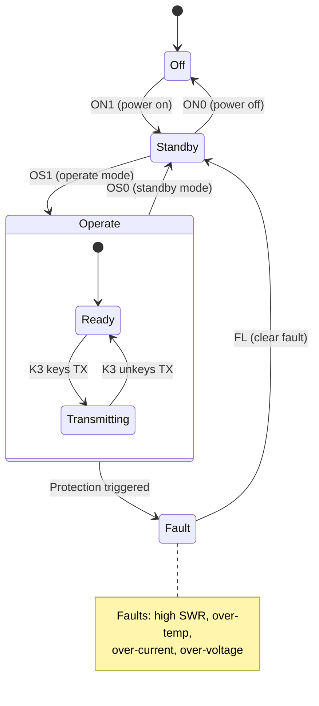
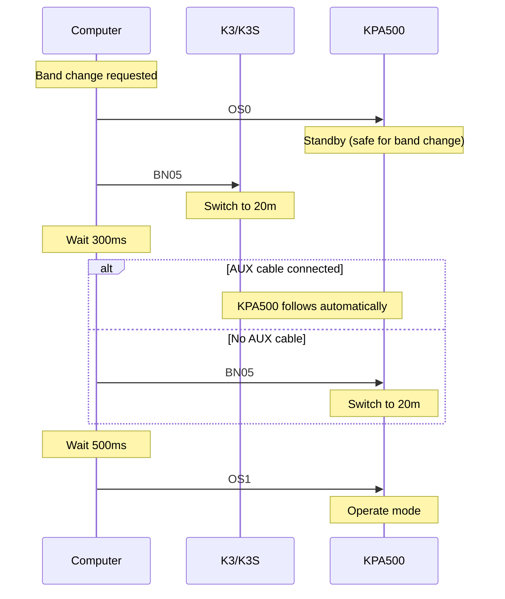

The KPA500 is a 500-watt solid-state HF/6M amplifier with its own serial interface, independent from the K3. This page covers the commands needed to power the amplifier on and off, coordinate band changes with the K3, monitor operating parameters, and handle faults. For the complete command listing, see the [KPA500 Remote Command Reference](/elecraft-docs/reference/kpa500-commands/). For product details, see the [KPA500 product page](/elecraft-docs/kpa500/).

:::note
The KPA500 has its own serial port — it is a **separate device** from the K3. Your application must open two serial connections: one for the K3 and one for the KPA500. Commands shown on this page are sent to the KPA500, not the K3, unless explicitly noted.
:::

## Commands Used

| Command | Description            | GET | SET |
| ------- | ---------------------- | --- | --- |
| `^ON`   | Power status/control   | Yes | Yes |
| `^OS`   | Standby/Operate mode   | Yes | Yes |
| `^BN`   | Band selection         | Yes | Yes |
| `^FL`   | Fault value            | Yes | Yes |
| `^WS`   | Power and SWR          | Yes | No  |
| `^VI`   | PA voltage and current | Yes | No  |
| `^TM`   | PA temperature         | Yes | No  |
| `^PF`   | Forward power          | Yes | No  |
| `^PR`   | Reverse power          | Yes | No  |

## 1. KPA500 Overview

The KPA500 is a 500-watt solid-state HF/6M amplifier. It has:

- Its own RS-232 serial port (DB-9 on the rear panel)
- Automatic band following when connected to the K3 via AUX cable
- Independent power on/off
- Built-in fault protection (SWR, temperature, current, voltage)

## 2. Serial Connection

The KPA500 uses a separate serial port from the K3 — a different COM port or device path on the host computer.

| Parameter    | Value |
| ------------ | ----- |
| Baud rate    | 38400 |
| Data bits    | 8     |
| Parity       | None  |
| Stop bits    | 1     |
| Flow control | None  |

Commands use the same semicolon-terminated ASCII format as the K3. Characters can be upper or lower case; the KPA500 always responds in upper case.

:::tip
The KPA500 Programmer's Reference uses a `^` prefix to distinguish KPA500 commands from K3 commands (e.g., `^ON` vs. `ON`). This prefix is a documentation convention only — the actual bytes sent over the serial port are just the command letters followed by a semicolon (e.g., `ON;`).
:::

## 3. KPA500 State Machine

The KPA500 has three primary states: Off, Standby, and Operate. Understanding the state machine is essential for correct programmatic control.



- **Off** — the amplifier is powered down. Only the `^ON` command is accepted.
- **Standby** — the amplifier is powered on but not amplifying. RF passes through the amp without gain.
- **Operate** — the amplifier is active. When the K3 keys TX, the KPA500 amplifies the signal.
- **Fault** — a protection event has occurred. The KPA500 automatically returns to Standby. Query and clear faults with `^FL`.

## 4. Power Control

```text
ON;           Query power state → ON0; (off) or ON1; (on)
ON1;          Power on the KPA500
ON0;          Power off the KPA500
```

After sending `ON1;`, wait approximately 3 seconds for the amplifier to initialize before sending further commands. The KPA500 powers on in Standby mode by default.

```text
ON1;          Power on
              Wait 3 seconds
ON;           Verify → ON1;
```

:::note
If the KPA500 was shut down due to a fault, it may require a brief cool-down period before it will accept `ON1;` again. Query with `ON;` to check the current state.
:::

## 5. Operating State

```text
OS;           Query operating state → OS0; (standby) or OS1; (operate)
OS1;          Switch to Operate mode
OS0;          Switch to Standby mode
```

- **Operate** (`OS1;`) — the amplifier is active and will amplify when the K3 transmits.
- **Standby** (`OS0;`) — RF passes through but is not amplified. Use Standby during band changes and when you want the amp powered on but inactive.

:::caution
Never switch to Operate mode while the K3 is transmitting. Always ensure the K3 is in receive before sending `OS1;`.
:::

## 6. Band Control

```text
BN;           Query current band → BN05; (20m)
BN05;         Set band to 20m
```

Band numbers follow the same scheme as the K3:

| Code | Band | Code | Band |
| ---- | ---- | ---- | ---- |
| `00` | 160m | `06` | 17m  |
| `01` | 80m  | `07` | 15m  |
| `02` | 60m  | `08` | 12m  |
| `03` | 40m  | `09` | 10m  |
| `04` | 30m  | `10` | 6m   |
| `05` | 20m  |      |      |

:::tip
When the K3 and KPA500 are connected via the AUX cable, the KPA500 automatically follows band changes made on the K3. If you are not using the AUX cable, your software must send `^BN` to the KPA500 whenever you change bands on the K3.
:::

## 7. Fault Monitoring

```text
FL;           Query and clear fault → FL00; (no fault) or FL + fault code
```

Fault codes:

| Code   | Fault            |
| ------ | ---------------- |
| `FL00` | No fault         |
| `FL01` | High SWR         |
| `FL02` | High current     |
| `FL03` | High temperature |
| `FL04` | High voltage     |
| `FL05` | Low voltage      |
| `FL06` | Over drive       |

When a fault occurs, the KPA500 automatically returns to Standby to protect itself. Sending `FL;` both queries the fault code and clears it, allowing the amplifier to be returned to Operate after the condition is resolved.

:::caution
Do not blindly clear faults and return to Operate. Check the fault code, address the underlying issue (e.g., high SWR indicates an antenna problem), and only then switch back to Operate.
:::

## 8. Monitoring

Use these commands to monitor operating parameters while the KPA500 is in Operate mode.

```text
WS;           SWR reading → WS0150; (SWR format: 0100 = 1.0:1)
VI;           Voltage and current → operating voltage and PA current
TM;           Temperature reading
PF;           Forward power
PR;           Reverse power
```

- **SWR** (`^WS`) — uses the same format as the K3. A value of `0100` represents a 1.0:1 SWR; `0150` represents 1.5:1.
- **Voltage/Current** (`^VI`) — returns the PA supply voltage and drain current. Useful for monitoring amplifier health.
- **Temperature** (`^TM`) — returns the heatsink temperature. Watch for rising temperatures that could trigger a thermal fault.
- **Forward/Reverse Power** (`^PF`, `^PR`) — instantaneous power readings during transmit.

## 9. Band Coordination with K3

Changing bands requires coordination between the K3 and KPA500 to avoid transmitting into the wrong band filter. The recommended sequence puts the KPA500 into Standby, changes the band on the K3 (and KPA500 if no AUX cable), then returns to Operate.



:::caution
Always put the KPA500 in Standby before changing bands on the K3 to avoid transmitting into the wrong band filter. The AUX cable handles this automatically during manual operation, but programmatic band changes should explicitly manage the sequence.
:::

## 10. Practical Patterns

### KPA500 Startup Sequence

A complete startup sequence that powers on the amp, verifies the state, and switches to Operate:

```text
ON1;          Power on
              Wait 3 seconds
ON;           Verify → ON1;
BN;           Check band matches K3
OS1;          Switch to Operate
OS;           Verify → OS1;
FL;           Check for faults → FL00;
```

:::tip
Always verify each step with a GET before proceeding to the next. If `ON;` does not return `ON1;` after the wait period, the amplifier may have a problem that needs attention before continuing.
:::

### Monitoring Loop

While the KPA500 is in Operate mode, poll these commands periodically to keep your application's display current and to catch faults early:

```text
Every 2 seconds while in Operate:
  WS;         Read SWR
  VI;         Read voltage/current
  TM;         Read temperature
  FL;         Check for faults
```

:::note
A 2-second polling interval provides responsive monitoring without flooding the serial port. If a fault is detected (`FL` returns anything other than `FL00;`), alert the user and do not automatically return to Operate without operator confirmation.
:::

### Safe Shutdown Sequence

```text
OS0;          Switch to Standby
OS;           Verify → OS0;
ON0;          Power off
ON;           Verify → ON0;
```

## See Also

- [KPA500 Remote Command Reference](/elecraft-docs/reference/kpa500-commands/) — complete alphabetical command listing
- [KPA500 product page](/elecraft-docs/kpa500/) — product overview and interconnect information
- [Station Integration](/elecraft-docs/programming/station/) — coordinating K3 + KPA500 + KAT500 as a unified station
- [Connection & Discovery](/elecraft-docs/programming/connection/) — serial port setup for the K3
