This page covers the CAT commands that control receiver parameters on the K3/K3S. These commands let you adjust everything from gain and filtering to noise reduction and signal metering, giving software full control over the receive signal path.

For complete command syntax and all parameter details, see the [K3/K3S/KX3/KX2 CAT Command Reference](/elecraft-docs/reference/k3-commands/).

## Commands Used

| Command | Description               | GET | SET | $ (VFO B) |
| ------- | ------------------------- | --- | --- | --------- |
| `AG`    | AF gain                   | Yes | Yes | Yes       |
| `RG`    | RF gain                   | Yes | Yes | Yes       |
| `PA`    | Preamp                    | Yes | Yes | Yes       |
| `RA`    | Attenuator                | Yes | Yes | Yes       |
| `GT`    | AGC speed                 | Yes | Yes | No        |
| `BW`    | DSP bandwidth             | Yes | Yes | Yes       |
| `FW`    | Filter bandwidth + number | Yes | Yes | Yes       |
| `IS`    | IF shift                  | Yes | Yes | No        |
| `NB`    | Noise blanker             | Yes | Yes | Yes       |
| `NL`    | NB level                  | Yes | Yes | Yes       |
| `NR`    | Noise reduction           | Yes | Yes | No        |
| `SQ`    | Squelch                   | Yes | Yes | Yes       |
| `SM`    | S-meter                   | Yes | No  | Yes       |

## 1. Signal Path Overview

The following diagram shows a simplified view of the receiver signal path and where each CAT command acts. Use it as a mental model for understanding how the commands relate to each other.

```mermaid
flowchart LR
    ANT[Antenna] --> RA_node[Attenuator<br/>RA]
    RA_node --> PA_node[Preamp<br/>PA]
    PA_node --> BPF[Band Pass<br/>Filter]
    BPF --> MIX[Mixer]
    MIX --> IF_node[IF Filter<br/>BW/FW]
    IF_node --> IS_node[IF Shift<br/>IS]
    IS_node --> AGC[AGC<br/>GT]
    AGC --> NB_node[Noise Blanker<br/>NB/NL]
    NB_node --> NR_node[Noise Reduction<br/>NR]
    NR_node --> SQ_node[Squelch<br/>SQ]
    SQ_node --> RG_node[RF Gain<br/>RG]
    RG_node --> AG_node[AF Gain<br/>AG]
    AG_node --> SPK[Speaker /<br/>Phones]
```



:::note
This is a simplified conceptual diagram. The actual DSP signal chain order within the K3/K3S may differ from what is shown here. The purpose is to illustrate which stage of the receiver each command controls.
:::

## 2. AF and RF Gain

### AF Gain (AG)

The `AG` command controls audio output level (volume). The parameter range is `000` to `255`.

```text
AG;              → AG127;          Query AF gain (currently 127)
AG200;                              Set AF gain to 200
AG$;             → AG$080;         Query sub receiver AF gain
AG$120;                             Set sub receiver AF gain to 120
```

### RF Gain (RG)

The `RG` command controls RF gain. The parameter range is `000` to `250`, where `250` is maximum gain.

```text
RG;              → RG250;          Query RF gain (currently maximum)
RG200;                              Set RF gain to 200
RG$;             → RG$250;         Query sub receiver RF gain
```

:::tip
RF gain at `250` is maximum. Decreasing the value reduces gain, which can be useful for managing strong-signal environments where AGC alone is not sufficient. Reducing RF gain lowers the noise floor and can improve readability of strong signals.
:::

## 3. Preamp and Attenuator

### Preamp (PA)

The `PA` command toggles the receiver preamplifier, which adds approximately 10-15 dB of gain.

```text
PA;              → PA0;            Query preamp state (currently off)
PA1;                                Turn preamp on
PA0;                                Turn preamp off
PA$1;                               Turn sub receiver preamp on
```

### Attenuator (RA)

The `RA` command toggles the receiver attenuator, which reduces signal level by approximately 10 dB.

```text
RA;              → RA00;           Query attenuator state (currently off)
RA01;                               Turn attenuator on
RA00;                               Turn attenuator off
RA$01;                              Turn sub receiver attenuator on
```

:::note
Preamp and attenuator are independent controls. You can have both off, one or the other on, or both on simultaneously (though having both on is rarely useful). On crowded bands with nearby strong signals, engaging the attenuator can reduce intermodulation distortion and improve reception of weaker stations.
:::

## 4. AGC

The `GT` command sets the AGC (Automatic Gain Control) speed. AGC controls how quickly the receiver adjusts its internal gain in response to signal level changes.

| Value    | Speed   |
| -------- | ------- |
| `GT000;` | AGC off |
| `GT002;` | Fast    |
| `GT004;` | Slow    |

```text
GT;              → GT004;          Query AGC speed (currently slow)
GT002;                              Set AGC to fast
GT000;                              Turn AGC off
```

:::tip
Use **slow AGC** (`GT004;`) for SSB and AM, where signal levels vary gradually. Use **fast AGC** (`GT002;`) for CW, where you need the receiver to recover quickly between characters. Turning AGC off (`GT000;`) is useful for digital modes or when you want manual gain control via `RG`.
:::

## 5. IF Filters

The K3/K3S offers two ways to control receive bandwidth: DSP-based filtering via `BW` and crystal filter selection via `FW`.

### DSP Bandwidth (BW)

The `BW` command sets the DSP filter bandwidth in Hz. The parameter is a 4-digit value.

```text
BW;              → BW2800;         Query bandwidth (currently 2800 Hz)
BW2400;                             Set bandwidth to 2400 Hz
BW0500;                             Set bandwidth to 500 Hz
BW$1800;                            Set sub receiver bandwidth to 1800 Hz
```

The allowable range is `BW0050;` (50 Hz) to `BW9999;` (limited by the installed crystal filter width).

### Filter Bandwidth and Number (FW)

The `FW` command provides more control by specifying both a bandwidth and a crystal filter slot number. The format is 5 digits for bandwidth in 10 Hz units followed by 2 digits for the filter number.

```text
FW;              → FW0280001;      Query filter (2800 Hz on filter 1)
FW0240002;                          Set 2400 Hz on filter 2
FW$;             → FW$0280001;     Query sub receiver filter
```

The filter number (01-08) selects which crystal filter slot is used. Each slot can hold a different roofing filter.

### Direct Crystal Filter Selection (XF)

The `XF` command selects a crystal filter slot directly without changing the bandwidth setting.

```text
XF01;                               Select crystal filter slot 1
XF02;                               Select crystal filter slot 2
```

Valid values are `XF01;` through `XF08;`.

:::note
When you set a bandwidth with `BW` or `FW`, the radio snaps to the nearest available value supported by the currently selected crystal filter. The response will reflect the actual bandwidth the radio applied, which may differ slightly from the requested value.
:::

## 6. IF Shift

The `IS` command shifts the IF passband up or down in frequency, measured in Hz. This moves the filter passband relative to the received signal without changing the tuned frequency.

```text
IS;              → IS 0000;        Query IF shift (currently centered)
IS+0500;                            Shift passband up 500 Hz
IS-0300;                            Shift passband down 300 Hz
IS 0000;                            Return to center (no shift)
```

The range is `IS-9999;` to `IS+9999;`. Positive values shift the passband up in frequency, negative values shift it down.

:::tip
IF shift is useful for avoiding nearby interference without retuning. If a station is interfering on one side of your passband, shift the passband away from the interference. This is often more effective than narrowing the filter bandwidth because it preserves audio fidelity.
:::

## 7. Noise Blanker

The noise blanker reduces impulse noise (ignition noise, power line interference, etc.).

### NB On/Off

```text
NB;              → NB0;            Query noise blanker state (off)
NB1;                                Turn noise blanker on
NB0;                                Turn noise blanker off
NB$1;                               Turn sub receiver noise blanker on
```

### NB Level (NL)

The `NL` command sets the noise blanker threshold. The range is `000` to `021`.

```text
NL;              → NL010;          Query NB level (currently 10)
NL015;                              Set NB level to 15
NL$008;                             Set sub receiver NB level to 8
```

Higher values make the blanker more aggressive, which removes more noise but may also clip strong signals. Start with a moderate value and increase until impulse noise is reduced without degrading desired signals.

## 8. Noise Reduction

The `NR` command toggles DSP-based noise reduction, which estimates and subtracts broadband noise from the received audio.

```text
NR;              → NR0;            Query noise reduction state (off)
NR1;                                Turn noise reduction on
NR0;                                Turn noise reduction off
```

:::note
Noise reduction works best on steady signals like CW carriers or SSB speech. It can introduce artifacts on rapidly changing signals. On weak CW signals, combining `NR1;` with a narrow `BW` setting is often very effective.
:::

## 9. Squelch

The `SQ` command sets the squelch threshold. When the received signal drops below this level, audio is muted. The range is `000` to `029`.

```text
SQ;              → SQ000;          Query squelch level (open / no squelch)
SQ010;                              Set squelch to level 10
SQ029;                              Set squelch to maximum
SQ$005;                             Set sub receiver squelch to 5
```

A value of `SQ000;` disables squelch (audio is always open). Increasing the value raises the threshold, requiring a stronger signal to open the squelch.

## 10. S-Meter Reading

The `SM` command reads the current signal strength. This is a GET-only command (no SET).

### Standard S-Meter

```text
SM;              → SM0012;         Read main receiver S-meter
SM$;             → SM$0008;        Read sub receiver S-meter
```

The returned value ranges from `0000` to approximately `0021`, mapping to S0 through S9+60 dB.

| Value | Approximate Reading |
| ----- | ------------------- |
| 0000  | S0                  |
| 0009  | S9                  |
| 0015  | S9+20 dB            |
| 0021  | S9+60 dB            |

### High-Resolution S-Meter (SMH)

The `SMH` command returns a 5-digit high-resolution S-meter value, available on the K3.

```text
SMH;             → SMH00115;       High-resolution S-meter reading
```

:::tip
The S-meter commands are useful for building signal-level monitoring tools, auto-fading systems, band scanning utilities, and propagation logging applications. Poll `SM;` periodically to track signal strength over time.
:::

## Practical Example: Optimize for Weak Signals

The following sequence configures the receiver for pulling out weak signals in a quiet band segment:

```text
PA1;         Preamp on
RA00;        Attenuator off
RG250;       RF gain maximum
BW0500;      Narrow 500 Hz filter
NR1;         Noise reduction on
NB1;         Noise blanker on
GT004;       Slow AGC
```

This combination maximizes front-end gain (`PA1`, `RG250`), narrows the receive bandwidth to reduce noise, and engages both DSP noise reduction and the noise blanker. Slow AGC prevents the receiver from overreacting to brief noise bursts.

:::note
For strong-signal environments (contests, crowded bands), you would typically do the opposite: turn the preamp off (`PA0;`), engage the attenuator (`RA01;`), reduce RF gain, and use a wider filter to maintain audio quality while relying on AGC to manage levels.
:::
