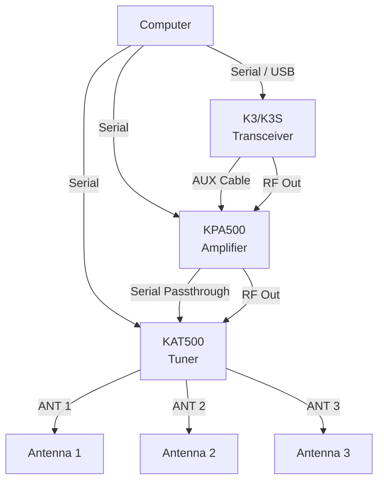
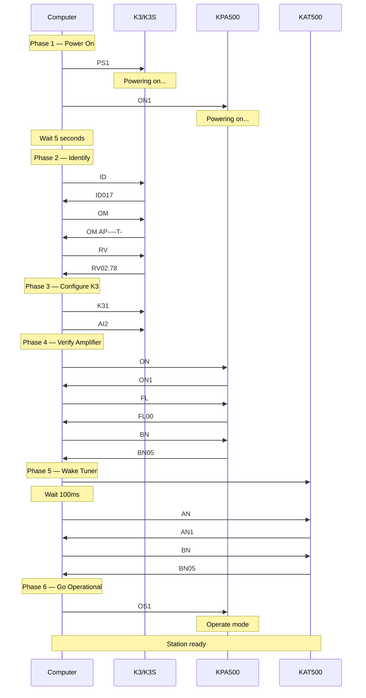
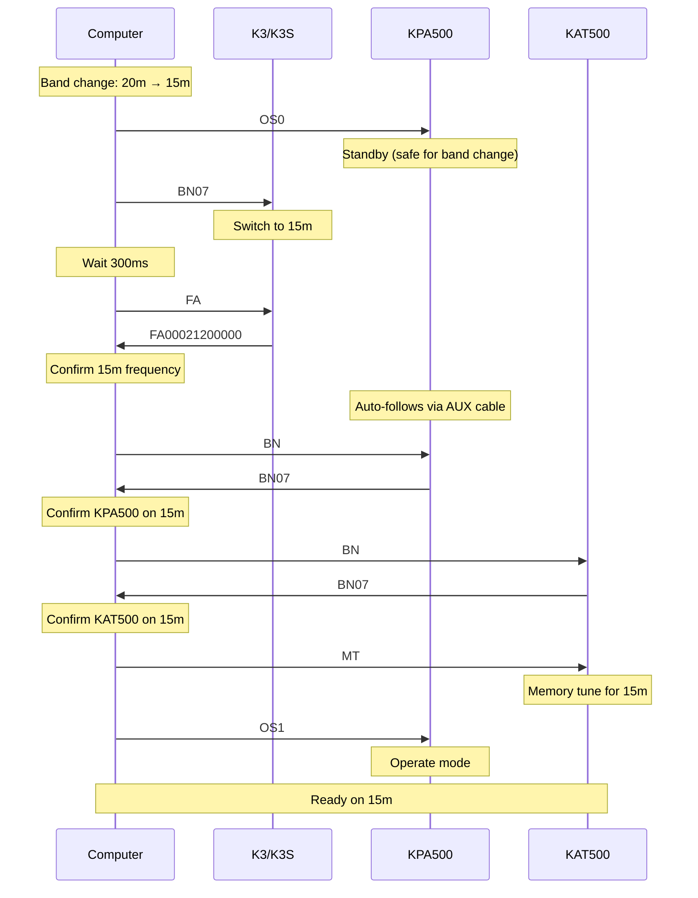
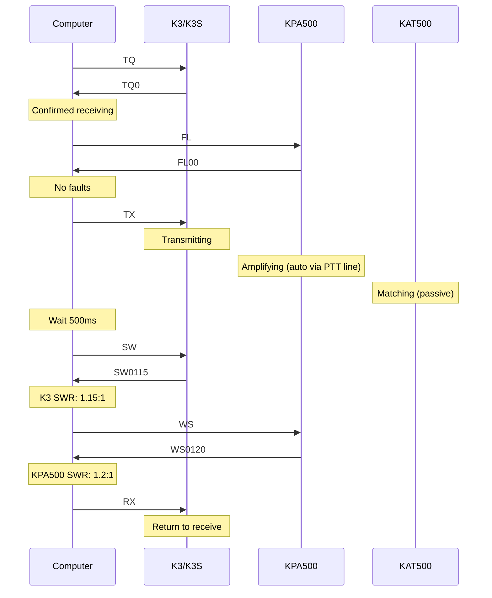

This capstone page shows how to coordinate an entire Elecraft station from software: a K3 or K3S transceiver, KPA500 amplifier, and KAT500 antenna tuner. Each device has its own serial interface and command set, so your application must manage multiple connections simultaneously.

For the individual device commands, see [KPA500 Integration](/elecraft-docs/programming/kpa500/) and [KAT500 Integration](/elecraft-docs/programming/kat500/). For complete command references, see the [KPA500 Command Reference](/elecraft-docs/reference/kpa500-commands/) and [KAT500 Command Reference](/elecraft-docs/reference/kat500-commands/).

## 1. Station Architecture

A full Elecraft station involves three serial connections to the computer and inter-device cabling for hardware-level coordination:



### Serial Connections to the PC

Your application must open and manage three independent serial ports:

- **K3/K3S**: USB (via the KIO3 interface board) or RS-232 — primary transceiver control for frequency, mode, transmit/receive, and all front-panel functions
- **KPA500**: RS-232 (DB-9) — amplifier monitoring and control including power, band, faults, SWR, voltage/current, and temperature
- **KAT500**: RS-232 (DB-9) — tuner control for antenna selection, tuning, and VSWR monitoring (can also be daisy-chained through the KPA500)

### Inter-Device Connections

- **AUX cable** (K3 to KPA500): Provides automatic band following at the hardware level. When the K3 changes bands, the KPA500 automatically tracks the change without any software intervention. This is the primary coordination mechanism between the transceiver and amplifier.
- **KPA500 to KAT500**: RF path from amplifier output to tuner input. The KAT500 can also receive serial data passed through from the KPA500.

:::note
Even though the AUX cable provides hardware band following, your software should still verify that all devices are on the correct band after a change. The AUX cable handles the common case, but software verification catches edge cases and confirms the station is properly synchronized.
:::

## 2. Full Station Startup Sequence

Bringing up a three-device station requires a careful sequence to ensure each device is ready before the next step:



### Step-by-step

1. **Power on K3** (`PS1;`) and **KPA500** (`ON1;`) — the KAT500 powers on via the KPA500 daisy-chain or independently
2. **Wait 5 seconds** for all devices to complete their boot sequences
3. **Identify K3**: send `ID;`, `OM;`, `RV;` to confirm model number, installed options, and firmware version
4. **Configure K3**: send `K31;` to enable extended command mode, then `AI2;` to enable auto-information reporting
5. **Verify KPA500**: check power state (`ON;`), fault register (`FL;`), and current band (`BN;`)
6. **Wake KAT500**: send `;;` as a probe to wake the tuner from sleep, then verify antenna port (`AN;`) and band (`BN;`)
7. **Enable amplifier**: send `OS1;` to place the KPA500 in operate mode

:::tip
If the KAT500 does not respond to the initial `;;` probe, wait 500ms and retry. The tuner may be in deep sleep and require a second wake-up attempt.
:::

## 3. Coordinated Band Change

Changing bands requires coordination across all three devices. The key safety rule is to put the amplifier in standby before switching bands:



### Key points

- **Put KPA500 in Standby** (`OS0;`) before initiating the band change — this prevents the amplifier from transmitting during the transition
- **Change band on K3** (`BN07;`) — the KPA500 follows automatically via the AUX cable
- **Verify all three devices** are on the same band by querying each one
- **Initiate memory tune** on the KAT500 (`MT;`) to load the stored match for the new band/antenna combination
- **Re-enable KPA500 operate mode** (`OS1;`) only after all devices are confirmed on the correct band

:::caution
Always verify band agreement across all three devices before re-enabling operate mode. A band mismatch between the amplifier and tuner can result in high SWR and potential damage.
:::

## 4. TX Cycle — Full Station

A transmit cycle involves the K3 keying up, the KPA500 amplifying (triggered automatically via the PTT line), and the KAT500 providing passive matching:



Before transmitting, the software checks that the K3 is in receive (`TQ0;`) and the KPA500 has no faults (`FL00;`). During transmit, SWR can be monitored at both the K3 and KPA500 to verify the antenna system is properly matched.

## 5. Monitoring Loop

During operation, poll all three devices periodically to detect faults, track operating parameters, and keep the user interface updated:

```text
Every 2-5 seconds:
  K3:
    SM;        S-meter (or power when TX)
    TQ;        TX state

  KPA500:
    FL;        Fault check
    WS;        SWR (when TX)
    VI;        Voltage/current
    TM;        Temperature

  KAT500:
    VS;        VSWR
    FLT;       Fault check
```

:::tip
Stagger the polling across devices to avoid bunching serial traffic. For example, poll K3 at 0ms, KPA500 at 100ms, KAT500 at 200ms within each cycle. This distributes the serial load and reduces the chance of buffer overruns on any single port.
:::

:::note
The KPA500 `WS;` and K3 `SM;` commands return meaningful power/SWR data only during transmit. When the station is receiving, these values are either zero or stale. Check `TQ;` to determine whether the K3 is transmitting before interpreting power readings.
:::

## 6. Station Shutdown Sequence

Shut down in reverse order — disable software features first, then power off the amplifier, then the transceiver:

```text
1. AI0;         Disable K3 auto-info
2. OS0;         KPA500 to standby
3. ON0;         KPA500 power off
4. PS0;         K3 power off
                KAT500 sleeps automatically
```

The KAT500 does not require an explicit power-off command — it enters sleep mode automatically when the KPA500 is powered down (if daisy-chained) or after a period of inactivity.

## 7. Fault Recovery

When any device reports a fault, the top priority is to stop transmitting immediately. Never attempt to automatically retry after a fault — hardware faults require operator investigation.

### Fault response procedure

1. **Immediately send `RX;` to the K3** — stop transmitting
2. **Put KPA500 in standby**: `OS0;`
3. **Query fault details** on the faulted device
4. **Log the fault** for the operator
5. **Do not automatically retry** — wait for the operator to investigate and decide

### Example: KPA500 fault during transmit

```text
On KPA500 fault:
  K3:    RX;           Stop transmitting
  KPA:   OS0;          Standby
  KPA:   FL;           Read fault code
  Report to operator and wait
```

:::caution
Never automatically retry after a fault. High SWR, over-temperature, or over-voltage conditions indicate a hardware problem that the operator must investigate before resuming operation. Automatic retries risk equipment damage.
:::

### Common fault scenarios

| Source       | Condition               | Response                                           |
| ------------ | ----------------------- | -------------------------------------------------- |
| KPA500 `FL`  | High SWR (fault code 4) | Stop TX, check antenna connections and tuner match |
| KPA500 `TM`  | Over-temperature        | Stop TX, allow cool-down, check ventilation        |
| KPA500 `VI`  | Over/under voltage      | Stop TX, check power supply                        |
| KAT500 `FLT` | Tuner fault             | Stop TX, retune or check antenna                   |
| K3 `TQ`      | Unexpected TX state     | Send `RX;`, investigate cause                      |

## 8. Related Pages

- [KPA500 Integration](/elecraft-docs/programming/kpa500/) — detailed KPA500 commands and usage patterns
- [KAT500 Integration](/elecraft-docs/programming/kat500/) — detailed KAT500 commands and usage patterns
- [Error Handling](/elecraft-docs/programming/errors/) — retry logic and error recovery patterns for the K3
- [Event Handling](/elecraft-docs/programming/events/) — auto-information system for real-time K3 event notifications
- [KPA500 Command Reference](/elecraft-docs/reference/kpa500-commands/) — complete KPA500 command listing
- [KAT500 Command Reference](/elecraft-docs/reference/kat500-commands/) — complete KAT500 command listing
