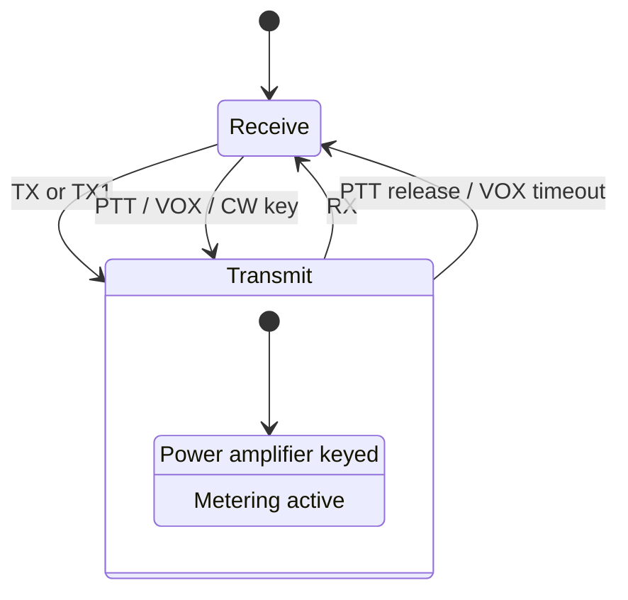
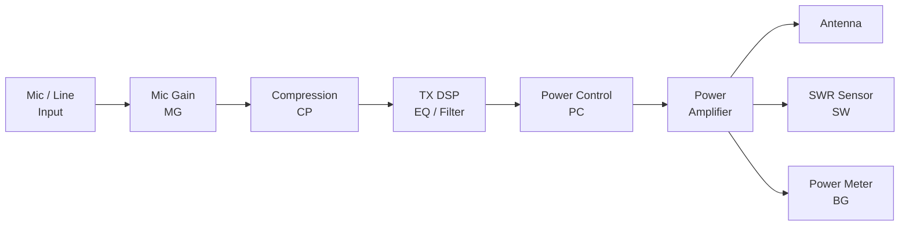

This page covers the commands used to control the transmitter on the K3/K3S: keying and unkeying, setting power output, adjusting mic gain and compression, reading SWR and power meters, and configuring VOX. For the complete alphabetical command listing, see the [K3/K3S/KX3/KX2 CAT Command Reference](/elecraft-docs/reference/k3-commands/).

## Commands Used

| Command | Description                     | GET | SET |
| ------- | ------------------------------- | --- | --- |
| `TX`    | Enter TX mode                   | No  | Yes |
| `RX`    | Enter RX mode                   | No  | Yes |
| `TQ`    | TX query (are we transmitting?) | Yes | No  |
| `PC`    | Power control (watts)           | Yes | Yes |
| `MG`    | Mic gain                        | Yes | Yes |
| `CP`    | Speech compression              | Yes | Yes |
| `ML`    | Monitor level                   | Yes | Yes |
| `VX`    | VOX on/off                      | Yes | Yes |
| `SW`    | SWR reading                     | Yes | No  |
| `BG`    | Bargraph reading                | Yes | No  |
| `TM`    | TX meter mode                   | Yes | Yes |

## 1. TX/RX State Control

The K3/K3S can be keyed into transmit mode either from the front panel (PTT switch, VOX, CW key) or remotely via the `TX` and `RX` commands.



- `TX;` or `TX1;` — key the transmitter (equivalent to pressing PTT)
- `TX0;` — key TX in "test" mode (reduced power, useful for testing without full output)
- `RX;` — unkey the transmitter (return to receive)
- `TQ;` → `TQ0;` (receiving) or `TQ1;` (transmitting) — query the current TX state

```text
TX;                  Key the transmitter
TQ;                  Query TX state → TQ1; (transmitting)
RX;                  Return to receive
TQ;                  Query TX state → TQ0; (receiving)
```

:::tip
Always check `TQ;` before sending TX-sensitive commands. Some parameters behave differently or cannot be changed while the radio is transmitting.
:::

:::caution
Always ensure you have a proper antenna connected and the correct band/frequency before commanding TX. Transmitting into a mismatched antenna can damage the power amplifier.
:::

## 2. Power Control

The `PC` command reads or sets the transmit power in watts. The value is a 3-digit, zero-padded number.

```text
PC;                  Query power → PC100; (100 watts)
PC010;               Set power to 10 watts
PC100;               Set power to 100 watts
PC005;               Set power to 5 watts (useful for tuning or QRP)
```

The valid range depends on the radio model:

| Radio                | Range   |
| -------------------- | ------- |
| K3 / K3S (with KPA3) | 000–110 |
| KX3 / KX2            | 000–015 |

:::note
Setting power to a low value (5–10 watts) before commanding `TX;` is a good practice during development and testing. This limits the risk of damage if something goes wrong with your antenna system.
:::

## 3. Mic Gain and Compression

These commands control the voice transmit audio chain and affect SSB, AM, and FM voice quality.

### Mic Gain (`MG`)

```text
MG;                  Query mic gain → MG020;
MG030;               Set mic gain to 30
```

Range: 000–060. Higher values increase the audio level from the microphone or line input.

### Speech Compression (`CP`)

```text
CP;                  Query compression → CP010;
CP020;               Set compression to 20
CP000;               Turn compression off
```

Range: 000–040 (0 = off). Compression increases average transmit power by reducing the dynamic range of voice audio.

:::tip
When adjusting mic gain and compression remotely, monitor the ALC meter (`TM1;` then read `BG;`) to ensure the audio level is not driving the transmitter into excessive ALC action. A small amount of ALC activity on voice peaks is normal; constant high ALC indicates the gain is set too high.
:::

## 4. Monitor Level

The `ML` command controls the transmit monitor, which lets you hear your own transmit audio through the speaker or headphones.

```text
ML;                  Query monitor level → ML030;
ML040;               Set monitor level to 40
ML000;               Turn monitor off
```

Range: 000–060. This is useful for checking audio quality and compression settings without needing a separate receiver.

## 5. VOX Control

### VOX On/Off (`VX`)

```text
VX;                  Query VOX state → VX0; (off)
VX1;                 Turn VOX on
VX0;                 Turn VOX off
```

When VOX is enabled, audio input on the microphone automatically keys the transmitter. The radio returns to receive after the audio stops, following the configured delay.

### QSK/VOX Delay (`SD`)

```text
SD;                  Query delay → SD050;
SD100;               Set delay to 100
```

Range: 000–255. The delay value is in approximately 10 ms steps for CW (QSK delay) but uses a different scale for voice VOX. Higher values keep the transmitter keyed longer after audio or keying stops.

:::note
VOX is most commonly used in voice modes (SSB, AM, FM) for hands-free operation. In CW mode, the `SD` command controls the QSK (full break-in) delay instead.
:::

## 6. TX Metering

The K3/K3S provides several metering commands for reading transmit power, SWR, and ALC activity.

### Bargraph Reading (`BG`)

```text
BG;                  Query bargraph → BG08;
```

Returns a value from 00 to 10 representing the number of power meter segments lit on the front panel display. The meaning depends on the current TX meter mode set by `TM`.

### SWR Reading (`SW`)

```text
SW;                  Query SWR → SW0150;
```

The response is a 4-digit value where `0100` represents a 1:1 SWR. Common readings:

| Response  | SWR   |
| --------- | ----- |
| `SW0100;` | 1.0:1 |
| `SW0120;` | 1.2:1 |
| `SW0150;` | 1.5:1 |
| `SW0200;` | 2.0:1 |
| `SW0300;` | 3.0:1 |

:::caution
SWR readings are only valid while the radio is transmitting. Reading `SW;` while in receive will return a stale or zero value. Always key the transmitter first and allow approximately 500 ms for the power amplifier to stabilize before reading SWR.
:::

### TX Meter Mode (`TM`)

The `TM` command selects what the TX meter displays:

| Value | Meter Mode   |
| ----- | ------------ |
| 0     | SWR          |
| 1     | ALC activity |
| 2     | Power output |

```text
TM;                  Query meter mode → TM0; (SWR)
TM1;                 Switch to ALC meter
TM2;                 Switch to power meter
```

### Power Reading via S-Meter (`SM`)

When the radio is transmitting, the `SM;` command reads power output instead of the S-meter. This provides a higher-resolution power reading than the bargraph.

## 7. ALC and Transmit Signal Chain

The diagram below shows how audio flows through the transmit chain, from input to antenna, and where each command acts:



Audio enters through the microphone or line input, passes through mic gain (`MG`), speech compression (`CP`), and the TX DSP (equalization and filtering). The resulting signal is scaled by the power control (`PC`) setting and fed to the power amplifier. At the output, the SWR sensor (`SW`) and power meter (`BG`) provide real-time measurements.

## 8. Practical Patterns

### Safe TX Sequence

A typical pattern for testing transmit from software, using low power to minimize risk:

```text
PC005;               Set low power for testing
TQ;                  Check if already transmitting
                     Expect TQ0; (receiving)
TX;                  Key transmitter
                     Wait for operation...
RX;                  Return to receive
TQ;                  Verify TX stopped
                     Expect TQ0;
```

:::tip
Wrapping every transmit operation in a `TQ` check before and after ensures your application always knows the true TX state, even if the operator keys or unkeys the radio manually.
:::

### Reading SWR During Transmit

To measure SWR, key the transmitter and allow the power amplifier time to settle:

```text
TX;                  Key transmitter
                     Wait 500ms for PA to stabilize
SW;                  Read SWR → SW0120; (1.2:1)
BG;                  Read power → BG08; (about 80% of scale)
RX;                  Return to receive
```

:::note
If the SWR exceeds approximately 3:1, the K3/K3S automatically reduces power to protect the amplifier. If you see unexpectedly low `BG` readings paired with high `SW` values, the radio is folding back power due to a mismatch.
:::

## Next Steps

Continue to [Voice, CW & Data](/elecraft-docs/programming/voice-cw-data/) to learn about CW keying, stored messages, and data sub-mode operations.
