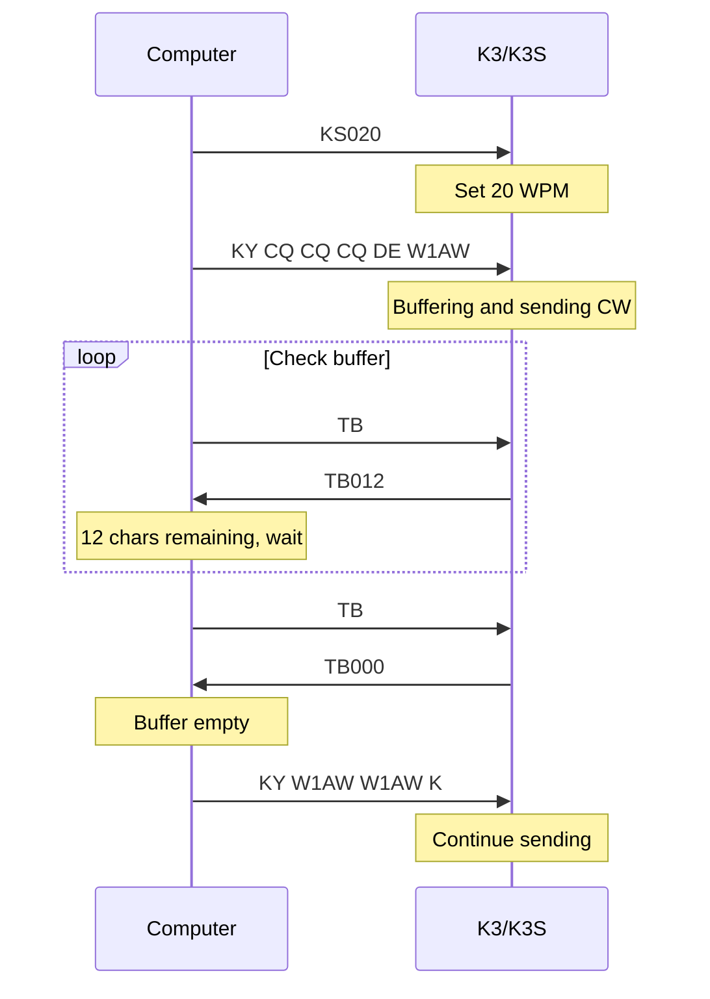

This page covers the commands used for mode-specific operations: SSB voice, AM/FM, CW keying and text sending, and digital/data modes. For operating mode selection and DATA sub-mode basics, see [Frequency & Modes](/elecraft-docs/programming/frequency-modes/). For the complete alphabetical command listing, see the [K3/K3S/KX3/KX2 CAT Command Reference](/elecraft-docs/reference/k3-commands/).

## SSB Voice Operation

SSB (Single Sideband) is the most common voice mode on HF. The K3/K3S supports both LSB and USB, with convention dictating which to use based on frequency.

### Mode Setup

```text
MD1;                 Set LSB (Lower Sideband)
MD2;                 Set USB (Upper Sideband)
```

:::note
By convention, LSB is used below 10 MHz and USB is used above 10 MHz. This is not enforced by the radio — you can select either sideband on any frequency — but following the convention ensures other stations can hear you.
:::

### Microphone Gain

The `MG` command controls microphone gain, affecting how much audio drive reaches the transmitter.

```text
MG;                  Query mic gain → MG030;
MG030;               Set mic gain to 30
```

The valid range is 000 to 060.

### Speech Compression

The `CP` command enables and controls the speech compressor, which increases average power by reducing the dynamic range of voice audio.

```text
CP;                  Query compression → CP015;
CP000;               Compression off
CP015;               Set compression to 15
```

The valid range is 000 to 040, where 000 disables compression.

:::tip
Start with compression at 000 (off) and increase gradually. Typical values are 010 to 020 for casual operation. Higher values increase average power but can degrade audio quality if overdriven.
:::

### TX Equalizer

The `TE` command enables or disables the transmit audio equalizer, which shapes the frequency response of your transmitted audio.

```text
TE;                  Query TX EQ state
TE1;                 Enable TX equalizer
TE0;                 Disable TX equalizer
```

### Extended SSB (ESSB)

The `ES` command controls Extended SSB mode, which widens the transmit audio bandwidth beyond the standard SSB passband for higher-fidelity voice.

```text
ES;                  Query ESSB state
ES1;                 Enable Extended SSB
ES0;                 Disable Extended SSB
```

:::caution
ESSB transmits a wider audio signal that occupies more spectrum. Use it only when band conditions and adjacent-channel spacing allow. It is not appropriate for crowded band conditions or contests.
:::

### Monitor Level

The `ML` command sets the transmit monitor level, allowing you to hear your own transmitted audio through the headphones or speaker.

```text
ML;                  Query monitor level
ML020;               Set monitor level to 20
```

## AM/FM Operation

### AM Mode

```text
MD5;                 Set AM mode
```

AM uses both sidebands and a carrier. The K3/K3S can both transmit and receive AM.

### FM Mode

```text
MD4;                 Set FM mode
```

In FM mode, the squelch control is particularly important for muting noise when no signal is present.

```text
SQ;                  Query squelch level
SQ020;               Set squelch level to 20
```

:::note
FM deviation, CTCSS tone encode/decode, and repeater offset settings are configured through the menu system. Use the `MN` command to navigate menus and `MP` to read or set menu parameter values. These settings are not available as direct commands.
:::

## CW Operation

CW (Morse code) mode provides a rich set of commands for keyer speed, sidetone, text sending, and break-in timing.

### Key Commands

| Command | Description                   | Range          |
| ------- | ----------------------------- | -------------- |
| `KS`    | Keyer speed (WPM)             | 008-050        |
| `KY`    | Send CW text from buffer      | up to 24 chars |
| `CW`    | Sidetone pitch                | 0300-0990 Hz   |
| `AP`    | CW APF (audio peaking filter) | 0/1            |
| `SD`    | QSK delay                     | 000-255        |

### CW Keyer Speed

The `KS` command reads or sets the internal keyer speed in words per minute.

```text
KS;                  Query keyer speed → KS020;
KS020;               Set keyer speed to 20 WPM
KS030;               Set keyer speed to 30 WPM
```

### Sidetone Pitch

The `CW` command controls the CW sidetone frequency, which also sets the receive audio center frequency for CW mode.

```text
CW;                  Query sidetone pitch → CW0600;
CW0600;              Set sidetone to 600 Hz
```

### Audio Peaking Filter (APF)

The `AP` command enables or disables the CW audio peaking filter, which narrows the receive audio response around the sidetone frequency.

```text
AP0;                 Disable APF
AP1;                 Enable APF
```

### Sending CW from Computer (KY Command)

The `KY` command sends up to 24 characters of CW text through the radio's internal keyer. This is the primary method for computer-generated CW.

```text
KY CQ CQ CQ DE W1AW ;
```

Supported characters include letters, numbers, and common punctuation. The `@` character inserts a prosign — the character before `@` and after `@` are sent as a single merged character:

```text
KY AR@;              Send AR prosign
KY BT@;              Send BT prosign
```

:::caution
You must wait for the buffer to empty before sending more text. Sending a `KY` command while the buffer is still full will result in lost characters.
:::

### Buffer Status (TB Command)

The `TB` command checks how many characters remain in the CW text buffer.

```text
TB;                  Query buffer → TB012; (12 chars remaining)
TB;                  Query buffer → TB000; (buffer empty, safe to send)
```

A response of `TB000;` means the buffer is empty and ready to accept another `KY` command.

### CW Buffered Sending Sequence

The following diagram shows the recommended pattern for sending CW text from a computer, including buffer management:



:::tip
For contest or rapid CW sending, poll `TB;` every 50-100 ms to keep the buffer fed without gaps. This provides smooth, continuous CW output from arbitrarily long text.
:::

### QSK (Full Break-In)

The `SD` command controls the QSK delay — the time the radio waits after the last CW element before returning to receive.

```text
SD000;               Zero delay — full QSK (hear between characters)
SD010;               Short delay
SD100;               Longer hang time (semi-break-in)
```

Full QSK (`SD000;`) lets you hear between individual CW elements, which is useful for detecting stations that break in during your transmission. Higher values provide semi-break-in with a longer hang time, reducing the clicking effect of rapid TX/RX switching.

## DATA Mode Operation

DATA mode is used for all digital communication: FT8/FT4 (WSJT-X), RTTY, PSK31, JS8Call, and other sound-card or direct-keying modes.

### Sub-Mode Selection

First set DATA mode, then select the sub-mode with `DT`:

```text
MD6;                 Set DATA mode (or MD9; for DATA-REV)
```

| Command | Sub-Mode | Description                                               |
| ------- | -------- | --------------------------------------------------------- |
| `DT0;`  | DATA A   | Sound card digital modes via MIC/LINE input (most common) |
| `DT1;`  | AFSK A   | Audio FSK via MIC input                                   |
| `DT2;`  | FSK D    | Direct FSK keying via KEY jack                            |
| `DT3;`  | PSK D    | Direct PSK via accessory port                             |

### DATA A (Sound Card Modes) — Most Common

DATA A is the sub-mode used with WSJT-X (FT8/FT4), fldigi, JS8Call, and most modern digital mode software. Audio is routed between the computer sound card and the radio via the LINE IN/LINE OUT connections.

```text
MD6;                 Set DATA mode
DT0;                 DATA A sub-mode
PC005;               Low power for digital (typically 5-15W)
```

:::tip
For FT8 and other digital modes, DATA A (`DT0;`) with USB-based audio via sound card is the standard configuration. The K3's LINE IN/LINE OUT on the KIO3 board provides clean audio paths.
:::

### FSK D (Direct FSK)

FSK D is used for RTTY with hardware FSK keying. The KEY jack on the rear panel provides the direct FSK keying input.

```text
MD6;                 Set DATA mode
DT2;                 FSK D sub-mode
```

This bypasses the sound card entirely, using direct digital keying for cleaner RTTY signals.

### DATA-REV

`MD9;` sets DATA-REV mode, which reverses the sideband used for data transmission. This is occasionally needed for compatibility with certain digital mode configurations.

```text
MD9;                 Set DATA-REV mode
DT0;                 DATA A sub-mode (reversed sideband)
```

## Voice Message Playback

The KDVR3 option (digital voice recorder) enables recording and playback of voice messages. Four voice message slots are available, triggered via the `SWT` command which emulates front-panel button taps.

```text
SWT33;               Play voice message 1
SWT34;               Play voice message 2
SWT35;               Play voice message 3
SWT36;               Play voice message 4
```

:::note
Voice message playback requires the KDVR3 option to be installed. You can verify its presence by checking position 5 of the `OM` response — a `D` in that position indicates the KDVR3 is installed. See [Connection & Discovery](/elecraft-docs/programming/connection/) for details on the `OM` command.
:::

## Next Steps

Continue to [Advanced Features](/elecraft-docs/programming/advanced/) for split operation, sub receiver control, diversity reception, and memory channels.
